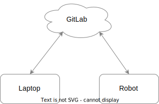

+++
title = "Деплой на роботов с ROS и Docker"
date = "2023-08-27"
draft = true

[taxonomies]
tags = ["docker", "ROS", "robotics", "eurobot", "skoltech"]
+++

Эта статья требует от вас знаний Docker и опыта работы с ним. В противном случае 90% контента вы не поймете.

# Предыстория

> Если вы не знакомы со спецификой соревнований Eurobot, лучше сначала ознакомиться c [официальным сайтом](https://www.eurobot.org/eurobot-contest/) и [YouTube каналом](https://www.youtube.com/live/BvLpiho28uI?si=m2owafdwym0hwJIT&t=1405).

С сентября 2022 года по май 2023 я был частью команды [RESET](https://www.skoltech.ru/2023/05/reset-stal-chempionom-sorevnovanij-avtonomnyh-robotov-eurobot-russia-2023/) из [Сколтеха](https://www.skoltech.ru/). И мы готовились к соревнованиям по робототехнике [Eurobot 2023](https://www.eurobot.org/eurobot-contest/eurobot-2023/).

В команде RESET выстроена преемственность — участники соревнований прошлого года выступают наставниками для участников нового года. Преемственность сохранялась также и в том, как происходил деплой/доставка софта на роботов.

## Дедовский способ доставки

Из года в год разработка под роботов происходила примерно одинаково. Заводился Git репозиторий в GitLab, локальная копия репозитория была и на ноутбуках участников, и на роботах. Когда участники команды вносили изменения локально у себя на компах, для переноса на робота они пушили изменения в GitLab репозиторий, а потом подтягивали (pull) изменения на роботе. Иногда передавали файлы по SSH.

К роботам подключались клавиатуры, мыши и мониторы. С помощью этих же устройств на роботах запускали тот код, что был написан ранее. Иногда код редактировали прямо на роботах, ~~это же так удобно, клава и монитор уже подключены~~. Потом эти правки пушили в GitLab.

<center>



</center>

Да, так можно делать, это самое очевидное и лежащее на поверхности решение. Но оно приводит к серьезнейшим проблемам:

1. **Конфликты зависимостей**

    Над софтом для каждого робота работают несколько участников команды. Кто-то пишет на Python, кто-то на C++. Возникали ситуации, когда версии библиотек в одних ROS пакетах конфликтовали в версиями библиотек из других.

1. **Невоспроизводимость (irreproducibility)**

    Никто не может гарантировать что после сноса или переустановки системы тот же самый код будет работать как раньше.

2. **Сопряженность (coupling)**

    Все пакеты разрабатываются и запускаются в одном окружении и вообще ничто не мешает сломать чужой код, даже не меняя его.

3. **Время билда**

    Код на C++ отдельно билдится на компах участников. А после попадания на робота этот же код билдится заново уже на роботе. Роботом в этот момент пользоваться нельзя.

4. **Бонусная мемная проблема: очереди**

    Вся работа с роботом ведется через клавиатуру, мышку и монитор. Придется подождать, пока другой участник сделает на роботе все что ему надо и освободит рабочее место.

## Повод нарушить традиции

В 2022 году один из наставников предложил изменить подход к разработке и попробовать запускать код на роботе в Docker контейнерах. В тот год в команду RESET как раз пришел айтишник (это я).

<center>


*Ребята, я в этом шарю*

</center>

Изначально при помощи Docker планировалось победить совсем другие проблемы, но позже оказалось, что этот подход почти во всем лучше старого.

# Окей, переходим на Docker

## Сформулируем требования

В "айтишной" части команды RESET было 4 человека:

1. Разработчик BehaviorTree и всей обвязки (это я).
2. Разработчик системы локализации.
3. Разработчик системы навигации.
4. Разработчик алгоритмов CV.

Изначально переход на Docker планировался ради того, чтобы было легко запускать и останавливать ROS ноды на роботе. Все потому что наш наставник уже знал про такие штуки, как оркестраторы Docker.

Решили, что каждый будет делать свой "микросервис" со своими ROS пакетами, не зависимыми от пакетов других разрабов. В ходе обсуждений мы поняли, что Docker также дает возможность прогать и тестировать каждый "микросервис" в изоляции от остальных. Единственной проблемой была необходимость публикации образов в облачных репозиториях. Мы хотели избежать использования интернета при передаче образов на роботов, потому что в поездках и на самих соревнованиях интернета часто может и не быть.

Таким образом требования следующие:

- Каждый разраб упаковывает ROS ноды в Docker образы, работает только со своими образами и не лезет в чужие.
- Разрабы должны иметь возможность пушить образы на роботов в локальной сети, избегая публикации в интернете.
- Разрабы не должны сильно шарить в Docker, все должно работать просто и интуитивно.

> **Спойлер:** Мы смогли всего добиться, попутно решив все описанные в начале статьи проблемы.

## Как здоровые люди деплоят с Docker

В дикой айтишной природе люди упаковывают свои приложения в Docker образы и загружают их в репозитории (registry). Самый крупный публичный репозиторий с образами это [Docker Hub](https://hub.docker.com/).

Репозитории могут быть и приватными. Такие, например, создают для себя компании, чтобы приложения, разрабатываемые внутри них, были доступны только сотрудникам. 

Но суть в том что репозитории всегда находятся на удаленных серверах и для того чтобы обмениваться с ними Docker образами, нужно подключение к интернету. Это не проблема, когда вы бэкендер и публикуете свой микросервис: и репозиторий, и сервер, на который доставляется приложение, находятся хрен знает где и оба подключены к интернету 24 на 7.

## Упаковываем ROS пакеты в Docker

ROS, это Ubuntu определенной версии с [установленными пакетами](https://docs.ros.org/en/humble/Installation/Ubuntu-Install-Debians.html) из репозитория ROS. В Docker Hub уже есть [готовые Docker образы с установленным ROS](https://hub.docker.com/_/ros/), мы будем использовать их в качестве базовых образов.

### Структура проекта

Весь код для роботов мы поместили в монорепозитории, который разбили на "воркспейсы" — по одному на каждое независимое направление разработки:

1. `bt/` - пакеты для Behavior Tree.
2. `communication/` - пакеты для общения между STM и компьютером.
3. `localization/` - пакеты, обеспечивающие локализацию робота.
4. `navigation/` - пакеты, работающие с навигацией робота.
5. `common/` - общий код расшаренный между воркспейсами.
6. Есть еще воркспейсы для CV, но их рассматривать не будем.

Далее один воркспейс == один Docker образ. 

Пакеты в ROS2 собираются при помощи мета-системы сборки, которая называется **Colcon**. Я пишу "мета", потому что Colcon это обертка, запускающая CMake и make. ~~Каждый раз когда плюсовики делают систему сборки, получается обертка над make.~~

Структура каждого workspace'а следующая:

```text
workspace/
├─ src/
│  ├─ ros_package_1/
│  ├─ ros_package_2/
├─ Dockerfile
```

Если терминал открыт в корневой директории воркспейса, то билд всех пакетов можно запустить командой:

```bash
colcon build
```

### Собираем образ из воркспейса

В корне каждого воркспейса помещен Dockerfile, в котором собственно и написано, как превратить воркспейс в Docker образ. В общих чертах сборка образа выглядит так:

1. Наследуемся от `ros:humble-ros-core`.
2. Устанавливаем необходимые зависимости.
3. Собираем и устанавливаем наши ROS пакеты.

Все наши образы мы наследовали от базового образа `ros:humble-ros-core`, но зафиксировали версию, чтобы не пересобирать все с нуля в случае его обновления. Это плохая практика при написании приложений для прода, но у нас тут соревновательная робототехника, ~~так что пiхуй~~. Дальше объясню, чем такой вариант хорош для нашего случая.

```dockerfile ,linenos
## `ros:humble-ros-core` from Dec 9, 2022: https://github.com/docker-library/repo-info/commit/f150644a2
FROM ros@sha256:23aa104a31990bb6952f2836cbf431535ae53490d587a70b32e0ed94a9a4fd83
```

Далее идет слой, общий для всех образов Eurobot. Там мы устанавливаем зависимости, которые нужны всем воркспейсам.

```dockerfile ,linenos ,linenostart=4
# install common dependencies (this layer must be the same in all workspaces)
RUN apt update && apt install -y \
    git \
    cmake \
    build-essential \
    python3-pip \
    python3-colcon-common-extensions \
    ros-$ROS_DISTRO-rmw-cyclonedds-cpp
```

```rs
if a == b
```
