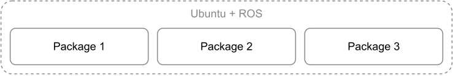
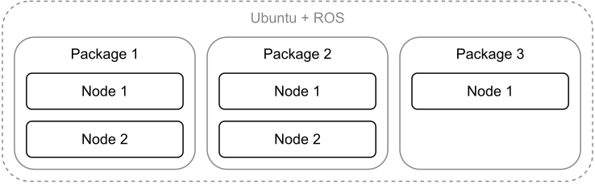
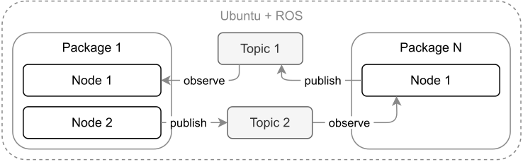
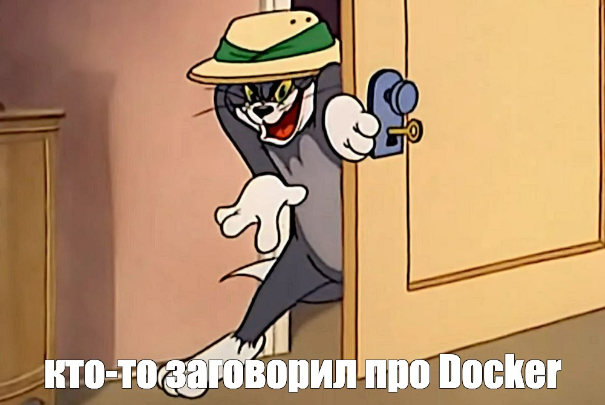
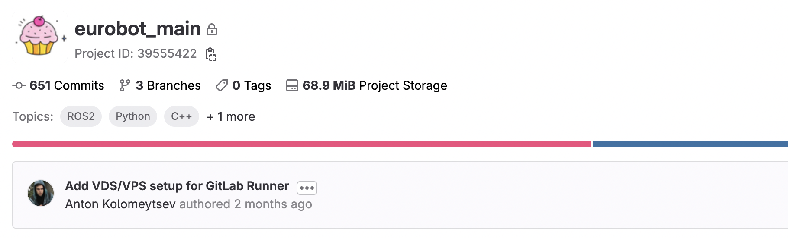

+++
title = "Опыт Eurobot: ROS2 вместе с Docker"
date = "2023-08-28"

[taxonomies]
tags = ["docker", "ROS", "robotics", "eurobot", "skoltech", "practical case"]
+++

Если вы не знакомы со спецификой соревнований Eurobot, лучше сначала ознакомиться c [официальным сайтом](https://www.eurobot.org/eurobot-contest/) и [YouTube каналом](https://www.youtube.com/live/BvLpiho28uI?si=m2owafdwym0hwJIT&t=1405).

С сентября 2022 года по май 2023 я был частью команды [RESET](https://www.skoltech.ru/2023/05/reset-stal-chempionom-sorevnovanij-avtonomnyh-robotov-eurobot-russia-2023/) из [Сколтеха](https://www.skoltech.ru/). И мы готовились к соревнованиям по робототехнике [Eurobot 2023](https://www.eurobot.org/eurobot-contest/eurobot-2023/).

# Предпосылки использования Docker

> До моего прихода в команде RESET не использовали Docker, поэтому совершенный нами переход можно назвать большим шагом вперед.

## Проект с кодом для роботов на ROS
<!-- Тут рассказать про то, что из себя представляют проекты на ROS и как взаимодействуют между собой -->

В последние годы команда RESET разрабатывает софт для роботов на базе [ROS](https://www.ros.org/). Это удобно, из-за того что ROS позволяет быстро прототипировать функционал, неплохое решение для соревновательной робототехники.

Я не буду полностью расписывать принципы работы ROS, для этого есть [официальные туториалы](https://docs.ros.org/en/humble/Tutorials/Beginner-CLI-Tools.html), но расскажу концепты, важные для текущей статьи. Главная фишка, которую дает ROS — модульность. Вы можете вести разработку подсистем робота в отдельных проектах/репозиториях, устанавливать чужие пакеты, а потом заставить все это работать вместе. Например, системы навигации, управления приводами и принятия решений могут быть разными приложениями, запускаемыми по-отдельности. ROS предоставляет интерфейс для обмена данными между этими приложениями.

### Пакеты

Самая крупная "программная единица" в ROS, это пакет (package).
**Пакет** — это один проект на С++ или Python, с файлом `package.xml` в корне и c подключенными библиотеками ROS.

<center>



</center>

### Ноды

Каждый пакет в ROS может содержать в себе ограниченное здравым смыслом количество нод (node). **Ноды** — это программные сущности, при помощи которых разработчики взаимодействуют со всеми плюшками ROS. В библиотеках C++ и Python ноды это просто классы, от которых надо наследоваться, чтобы создать свои собственные ноды.

Если вы вообще не понимаете о чем речь, лучше ознакомиться с [официальным туториалом](https://docs.ros.org/en/humble/Tutorials/Beginner-CLI-Tools/Understanding-ROS2-Nodes/Understanding-ROS2-Nodes.html).

<center>



</center>

### Топики

Приложения сторонних разработчиков могут запускать свои ноды, мы можем запускать свои. Обмен данными между всеми нодами происходит при помощи топиков (topics). **Топик** — это шина данных со своим именем и типом данных. Ноды могут как сами публиковать данные в топики, так и прослушивать топики ожидая данных.

<center>



</center>

Для тех кому интересно: данные сериализуются в бинарный формат и передаются между процессами. Пока что примем, что это происходит при помощи черной магии. Для большего количества подробностей гляньте [официальное объяснение топиков](https://docs.ros.org/en/humble/Tutorials/Beginner-CLI-Tools/Understanding-ROS2-Topics/Understanding-ROS2-Topics.html).

## Опыт участников предыдущих лет
<!-- Тут рассказать про то, из чего вообще состоял проект (много реп) и как код разворачивали на роботах -->

Опыт команды RESET таков, что из примерно десяти человек, четверо занимаются написанием кода для роботов. Все потому что было выделено 4 направления разработки:

1. Стратегия, поведение робота на поле (**behavior tree**).
2. **Локализация**, работа с лидаром и одометрией.
3. **Навигация**, обработка данных с локализации, передвижение робота по полю.
4. **Компьютерное зрение**.

До нашего прихода программисты в команде RESET использовали понятие "модульности" на максимум. Поэтому каждый писал свои ROS пакеты в отдельном репозитории. Все репозитории хранились на GitLab и клонировались на роботов. На роботах писались `*.sh` скрипты, при помощи которых происходила компиляция и синхронный запуск всех пакетов.

Ребята активно использовали этот подход и сталкивались со следующими проблемами:

1. **Конфликты зависимостей**

    Над софтом для каждого робота работают несколько участников команды. Кто-то пишет на Python, кто-то на C++. Все пакеты в итоге устанавливались в одну систему. Возникали ситуации, когда версии библиотек в одних ROS пакетах конфликтовали в версиями библиотек из других.

1. **Невоспроизводимость (irreproducibility)**

    Никто не может гарантировать что после переустановки системы тот же самый набор пакетов будет работать как раньше.

2. **Сопряженность (coupling)**

    Ничто не мешает сломать чужой код, даже не меняя его. Достаточно просто обновить какую-нибудь библиотеку.

3. **Время билда**

    Код на C++ отдельно билдится на компах участников. А после попадания на робота этот же код билдится заново уже на роботе. Роботом в момент компиляции пользоваться нельзя.

4. **Мемная проблема: очереди**

    Вся работа с роботом ведется через клавиатуру, мышку и монитор. Приходится ждать, пока другой участник сделает на роботе все что ему надо и освободит рабочее место.

## Триггер изменений
<!-- Тут рассказать про предложение использовать докер и первичные причины, по которым хотелось его использовать -->

В 2022 году один из наставников предложил изменить подход к разработке и попробовать запускать код на роботе в Docker контейнерах. В тот год в команду RESET как раз пришел айтишник (это я).

<center>



*Ребята, я в этом шарю*

</center>

Я уже не помню, почему изначально наставник предлагал перейти на Docker. Вроде, потому что запускать и останавливать контейнеры проще, чем процессы ROS. Это уже не важно. Важно, что практика деплоя с Docker внедрена в айтишке повсеместно. Вы не найдете сейчас ни одного бэкендера, который бы не упаковывал свои приложения в образы.

Образы это круто:
- Вы вообще исключаете проблемы с воспроизводимостью. Если упакованное приложение работает у вас на компьютере, то и на другой машине оно заработает.
- Вы не паритесь даже по поводу ОС, на которой будет запущено ваше приложение.
- Приложения легко доставлять до конечной машины, на которой оно будет запущено.
- Для запуска упакованного приложения нужен только установленный Docker.

По факту, любой робот, это тот же самый бэкенд, только находящийся физически рядом. Так почему бы не применить практики деплоя на бэкенд в робототехнике?

В общем, так мы и начали путешествие от сохи к ракете.

<center>


</center>

# Переходим на Docker

Эта статья — практический кейс применения Docker в робототехнике, а не туториал. Для продолжения чтения требуются базовые знания Docker.

## Терминология

Далее я использую термины "приложение" и "контейнер" в одном и том же смысле.

<center>



</center>

## Новая структура проекта
<!-- Тут рассказать про то, как перешли на монорепу, какую структуру заложили в нее, какие преимущества и недостатки -->

Прежде всего, мы перенесли все 4 направления разработки в монорепозий. Не то чтобы это было обязательно, но так гораздо проще организовать процесс сборки, тестирования и доставки нашего кода до робота.

Примерная структура монорепозитория получилась следующей:

```sh
bt/ # behavior tree
├─ src/
│  ├─ ros_package_1/
│  ├─ ros_package_2/
├─ Dockerfile
communication/ # для связи с STM32
├─ src/
│  ├─ ...
├─ Dockerfile
localization/ # локализация
├─ src/
│  ├─ ...
├─ Dockerfile
navigation/ # навигация
├─ src/
│  ├─ ...
├─ Dockerfile
common/ # общий код
├─ src/
│  ├─ ...
```

Были созданы директории под каждое направление разработки. Назвали мы эти директории воркспейсами (workspace). Название выбрано не случайно, внутри каждой директории соблюдается структура [Colcon Workspace](https://docs.ros.org/en/foxy/Tutorials/Beginner-Client-Libraries/Creating-A-Workspace/Creating-A-Workspace.html). Это значит, что:

1. В `<workspace_name>/src/` можно класть пакеты ROS.
2. Находясь в директории `<workspace_name>/` можно билдить все пакеты при помощи `colcon build`.

## Сборка кода воркспейсов во время разработки
<!-- Тут рассказать про то, как собирался код воркспейсов во время разработки и отладки -->

Без Docker в целом все обыденно: вы пользуетесь Ubuntu с установленным ROS2 Humble, клонируете себе репозиторий, идете в свой воркспейс и открываете в VS Code те пакеты, с которыми сейчас работаете.

Если ваш воркспейс зависит от пакетов из `common/`, нужно сначала сбилдить общий воркспейс и установить его в систему:

```bash
cd common
colcon build
source install/setup.bash
echo "source $(pwd)/install/setup.bash" >>~/.bashrc
```

После этого в локальном окружении можно вести разработку без дополнительных усилий.

Мы разрабатывали под ROS2 не только на Ubuntu, но и из под Mac OS и Windows. Об этом лучше расскажу в другой раз, статья и так уже перегружена подробностями.

## Dockerfile для воркспейса
<!-- Тут рассказать про структуру докерфайла в каждом воркспейсе -->

Из каждого воркспейса будет собираться один Docker образ, для этого в корне каждого воркспейса есть `Dockerfile`. Структура этого файла во всех воркспейсах одинаковая:

```Dockerfile ,linenos
# Наследуемся от готового ROS образа версии Humble
FROM ros:humble-ros-core

# Общие для всех воркспейсов внешние зависимости
RUN apt update && apt install -y ...

# Специфичные для воркспейса внешние зависимости
RUN apt update && apt install -y ...
RUN pip3 install setuptools black pytest pygame

# Расшаривание общего кода между воркспейсами
COPY common/src/eurobot_interfaces /root/dependencies/eurobot_interfaces
COPY sh/ci/deps.sh /tmp/.deploy_cache/deps.sh
RUN bash /tmp/.deploy_cache/deps.sh

# Сборка пакетов воркспейса
ENV EUROBOT_KIND=bt
COPY $EUROBOT_KIND/src /tmp/.deploy_cache/src
COPY sh/ci/deploy.sh /tmp/.deploy_cache/deploy.sh
ARG DEPLOY
RUN bash /tmp/.deploy_cache/deploy.sh
```

Команды `FROM`, `COPY`/`ADD`, `RUN` создают [новые слои в Docker образе](https://stackoverflow.com/questions/31222377/what-are-docker-image-layers). Если меняются нижние слои (в Dockerfile они находятся выше по коду), то будут пересобраны все слои, находящиеся выше (те что ниже по коду Dockerfile). Поэтому в наших докерфайлах слои расположены в порядке возрастания по частоте их редактирования. Самые последние слои редактируются максимально часто, но они настолько легковесные, что это не занимает много времени.

### Фиксируем версию базового образа

Для простоты и экономии места я написал, что мы наследуемся от образа `ros:humble-ros-core`, но это только наполовину правда. В ходе работы мы заметили что этот образ часто получал обновления, что приводило к полной пересборке наших образов с нуля. Поэтому мы зафиксировали версию образа вот так:

```Dockerfile
## `ros:humble-ros-core` from Dec 9, 2022: https://github.com/docker-library/repo-info/commit/f150644a260b5a28
FROM ros@sha256:23aa104a31990bb6952f2836cbf431535ae53490d587a70b32e0ed94a9a4fd83
```

Это плохая практика при написании приложений для прода, но у нас тут соревновательная робототехника, ~~так что пiхуй~~.

### Общие для всех воркспейсов внешние зависимости

Следующим слоем после `FROM` идет установка пакетов из `apt`:

```bash
# Общие для всех воркспейсов внешние зависимости
RUN apt update && apt install -y \
    git \
    cmake \
    build-essential \
    python3-pip \
    python3-colcon-common-extensions \
    ros-$ROS_DISTRO-rmw-cyclonedds-cpp
```

Мы просто копипастили это во все докерфайлы, хотя вполне можно было сделать свой базовый образ и одновременно зафиксировать таким способом версию `ros:humble-ros-core` и первый слой с общими зависимостями. Я просто вовремя не додумался до этого. 

Одинаковые слои это такая "оптимизация" — если слой общий у всех докерфайлов, то он будет собираться только один раз и переиспользоваться для всех воркспейсов. [Docker использует ранее собранные слои](https://docs.docker.com/build/cache/), что значительно ускоряет процесс сборки. Я поместил сюда установку инструментов для сборки кода и установку кастомного ROS DDS.

### Специфичные для воркспейса внешние зависимости

Следующие два слоя, это установка пакетов из `apt` и `pip` по-отдельности. Вынес `pip` в отдельный слой, потому что `pip` часто выдавал ошибки и руинил весь билд.

```bash
# Специфичные для воркспейса внешние зависимости
RUN apt update && apt install -y \
    ros-$ROS_DISTRO-behaviortree-cpp-v3 \
    python3-tk \
    && apt autoremove && \
    # colored prompt
    sed -i 's/#force_color_prompt=yes/force_color_prompt=yes/g' ~/.bashrc && \
    # ROS source
    echo "source /opt/ros/$ROS_DISTRO/setup.bash" >> ~/.bashrc

RUN pip3 install setuptools black pytest pygame
```

Также в слой с установкой я поместил запись `source /opt/ros/$ROS_DISTRO/setup.bash` в файл `.bachrc`, для того чтобы при открытии bash внутри контейнера у нас [сразу регистрировалось окружение](https://answers.ros.org/question/251292/why-to-use-source-develsetupbash/), нужное для запуска бинарей ros.

### Расшаривание общего кода между воркспейсами
<!-- Тут рассказать про расшаривание воркспейса `common` между другими воркспейсами и почему это не самое плохое решение с точки зрения ROS -->

В директории `common/` нет своего `Dockerfile` потому что мы не собирали из него отдельный образ. Вместо этого хранили в нем общие на весь проект пакеты ROS. В докерфайлах других воркспейсов мы просто копировали нужные пакеты. В примере выше копируется только пакет `eurobot_interfaces`:

```bash
# Расшаривание общего кода между воркспейсами
COPY common/src/eurobot_interfaces /root/dependencies/eurobot_interfaces
COPY sh/ci/deps.sh /tmp/.deploy_cache/deps.sh
RUN bash /tmp/.deploy_cache/deps.sh
```

На самом деле скопировать можно и больше одного пакета. После копирования запускается скрипт `deps.sh`, который устанавливает пакеты внутри образа:

```sh
#!/bin/bash

source /opt/ros/$ROS_DISTRO/setup.bash || exit 1
# build dependencies if needed
if [ -d /root/dependencies ]; then
    cd /root/dependencies
    colcon build --symlink-install || exit 1
    echo "source /root/dependencies/install/setup.bash" >>~/.bashrc
fi
```

Логика у скрипта простая: если есть директория `/root/dependencies`, запускаем в ней `colcon build` и [регистрируем результаты сборки в окружении](https://answers.ros.org/question/251292/why-to-use-source-develsetupbash/) при помощи `source`.

### Сборка пакетов воркспейса

Последними слоями в наших образах являются результаты сборки уже наших собственных, специфичных для воркспейса пакетов. Здесь задается переменная окружения `EUROBOT_KIND` с названием воркспейса, которая потом используется в скриптах.

```bash
ENV EUROBOT_KIND=bt
COPY $EUROBOT_KIND/src /tmp/.deploy_cache/src
COPY sh/ci/deploy.sh /tmp/.deploy_cache/deploy.sh
ARG DEPLOY
RUN bash /tmp/.deploy_cache/deploy.sh
```

В образ копируется содержимое воркспейса и запускается скрипт `deploy.sh`, который уже собирает и устанавливает наши пакеты:

```sh
#!/bin/bash

PROJECT_DIR="/root/eurobot_main"
PACKAGE_DIR=$PROJECT_DIR/$EUROBOT_KIND

function cleanup() {
    rm -rf /tmp/.deploy_cache &>/dev/null
}

trap cleanup EXIT

case "$DEPLOY" in

"ci")
    echo "Deploying package in the cloud... "
    git clone \
        --branch master \
        --depth 1 \
        https://...@gitlab.com/reset_eurobot2023/eurobot_main.git \
        "$PROJECT_DIR" || exit 1
    ;;

"local")
    echo "Deploying package locally... "
    [ -d $PACKAGE_DIR/src ] || mkdir -p $PACKAGE_DIR/src
    cp -R /tmp/.deploy_cache/src $PACKAGE_DIR || exit 1
    ;;

*)
    echo "Skip deploying package"
    exit 0
    ;;

esac

source /opt/ros/$ROS_DISTRO/setup.bash || exit 1
[ -f /root/dependencies/install/setup.bash ] && source /root/dependencies/install/setup.bash
cd $PACKAGE_DIR
colcon build --symlink-install || exit 1
echo "source $PACKAGE_DIR/install/setup.bash" >>~/.bashrc
echo "Package deployed!"
```

У этого скрипта логика сложнее, чем у предыдущего. Здесь, в зависимости от переданного в docker аргумента `--build-arg DEPLOY=...` будет разная логика.

Если `DEPLOY` равен `"ci"`, то скрипт загрузит последнюю версию кода из репозитория и соберет ее. Этот функционал использовался для сборки "релизных" образов для публикации в наш Docker Registry.

Если `DEPLOY` равен `"local"`, то скрипт брал тот код воркспейса, который был скопирован в него изначально, и собирал его. При локальных сборках образа использовался именно этот способ.

Для всех других значений переменной `DEPLOY` никакой код не собирался. Эта опция использовалась для того чтобы подготовить образ, который был бы пригоден для создания VSCode Dev Container. Не тратилось время на сборку наших пакетов, потому что мы и так собирались потом использовать образ для создания контейнеров, внутри которых надо билдить наш код.

## Превращаем воркспейс в Docker образ
<!-- Тут рассказать про то, как проходит процесс сборки воркспейса в Docker образ -->

Мы пользовались специальными скриптами, которые позволяли собирать нам образы для любых воркспейсов одной командой. Запускали мы команды из корня репозитория примерно вот так:

```bash
./bldr build navigation
```

По факту, мы пользовались мета-системой сборки. Про нее расскажу в другой раз. При вызове команды выше под капотом запускался примерно такой код:

```sh
docker buildx build \
    --platform "linux/amd64" \
    --output "type=docker" \
    --tag "eurobot2023:navigation" \
    --build-arg DEPLOY="local" \
    --file navigation/Dockerfile \
    .
```

Используется `docker buildx`, потому что мы билдили и под ARM, и под x86 архитектуру. Docker [позволяет делать это](https://www.docker.com/blog/how-to-rapidly-build-multi-architecture-images-with-buildx/) на любых компьютерах.

Первая сборка занимает достаточно долгое время. Но все последующие сборки проходят быстро, ~~С++ разработчикам не привыкать~~. Как я уже ранее писал, когда мы меняем код пакетов в воркспейсе, пересобираются только самые последние слои образа, отвечающие за установку наших пакетов. Остальные слои образа кэшированы.

Если у вас больше одного пакета в воркспейсе и они написаны на C++, придется смириться с тем фактом, что все ваши пакеты будут пересобираться во время каждого билда, даже если изменения вы внесли всего в один. Да, при таком подходе билд-кэш для С++ завести не удалось, но нам хватало и этого до самых сорев. Я так и не улучшил текущее решение, но в конце статьи поделюсь мыслями на этот счет.

## Отправка образов на роботов
<!-- Эта часть слишком большая, оставить ссылку на следующую статью -->

<center>


</center>

Мы иногда использовали Docker Hub для публикации и скачивания наших образов, но в 99% случаев деплоили по локальной сети, избегая публикации в интернете.

К сожалению, для того чтобы рассказать, как я смог этого добиться, нужно такая же по объему статья. Поэтому просто скажу что работало это как черная магия. Потому что работало без вмешательства разработчиков, супер быстро и требовало ввода всего одной команды. Все были довольны. Готовлю статью на эту тему.

## Запуск и остановка контейнеров на роботе
<!-- Тут рассказать про запуск докера из терминала путем вызова docker run -->

Классический запуск контейнера происходит через вызов `docker run`. Мы успешно пропустили этот этап и перешли на Docker Compose, по трем причинам:

1. Мы сразу знали, что нужно будет запускать несколько контейнеров из разных образов.
2. Нам нужно было соблюсти порядок запуска контейнеров.
3. Нужно передавать кучу параметров в каждый контейнер, сделать это вручную нереально.

Чтобы проиллюстрировать третью причину, представляю вашему вниманию запуск контейнера с behavior tree на борту со всеми параметрами:

```bash
docker run \
    -e ROBOT_NAME=${ROBOT_NAME} \
    -e COMPANION_ROBOT_NAME=${COMPANION_ROBOT_NAME} \
    -e CYCLONEDDS_URI="<CycloneDDS><Domain><General><NetworkInterfaceAddress>${WLAN_DEVICE_NAME}</NetworkInterfaceAddress></General></Domain></CycloneDDS>" \
    -e BT_FILENAME=${BT_FILENAME} \
    -e ENEMIES=${ENEMIES} \
    -e BT_FREQ=${BT_FREQ} \
    -e PLATE_NUMBER=${PLATE_NUMBER} \
    -e SIX_BEACONS=${SIX_BEACONS} \
    -e STOLEN_CAKE_COST=${STOLEN_CAKE_COST} \
    -e DEBUG=true \
    -e SORT_CAKES=${SORT_CAKES} \
    -e COLLECT_CHERRIES=${COLLECT_CHERRIES} \
    -e STEAL_CAKE=${STEAL_CAKE} \
    --network host \
    --privileged \
    --name bt \
    -v ~/eurobot_main/strategies:/strategies \
    -v /etc:/etc \
    eurobot2023:bt \
    /bin/bash -c "
        source /etc/eurobot_config.sh
        source /root/eurobot_main/bt/install/setup.bash
        ros2 launch superbt bt_node.launch.py
    "
```

Мы в итоге запускали 6 контейнеров, так что запуск руками или через sh скрипты нам не не подходит.

## Выходим на новый уровень: Docker Compose
<!-- Тут рассказать про docker-compose -->


# Важные мелочи

## Использование .env файла
<!-- Тут рассказать про то, как не редачить постоянно docker-compose.yaml -->

## Использование кастомного ROS DDS
<!-- Тут рассказать про проблемы с работой дефолтного DDS в сети Docker -->

# К чему мы в итоге пришли

## Явные улучшения
<!-- Тут перечислить список проблем из начала статьи и рассказать как они исчезли 

- можно использовать образы с разными версиями ROS
-->

## Что можно улучшить
<!-- Тут рассказать про проблемы, возникающие из-за использования Docker -->

## Что я не затронул в статье
<!-- Заполнить после того как напишу статью -->
