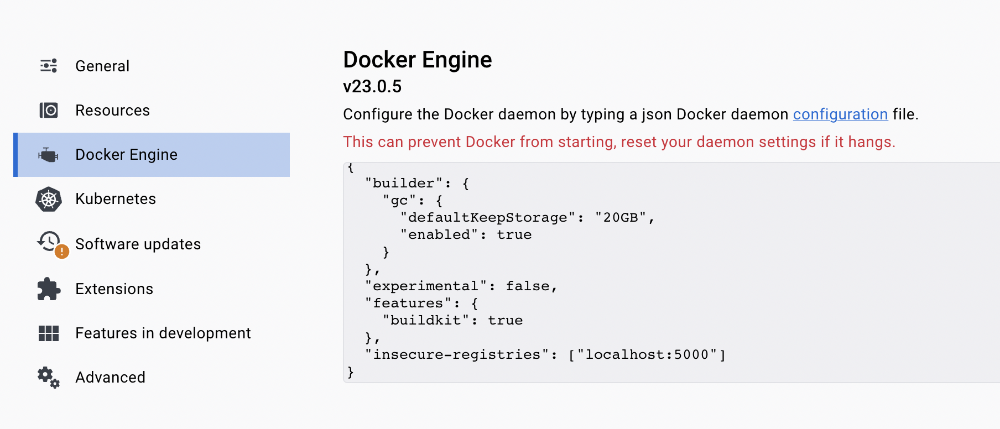

+++
title = "Опыт Eurobot: Деплой Docker образов на роботов в локальной сети"
date = "2023-09-01"
draft = true

[taxonomies]
tags = ["docker", "ROS", "robotics", "eurobot", "skoltech", "guide"]
+++

Продолжая серию постов про Eurobot, рассказываю про следующую деталь нашей инфраструктуры — доставку Docker образов до роботов в обход интернета и удаленных Docker Registry.

[В предыдущем посте](/posts/eurobot-experience-docker-with-ros/) я рассказал о том, как мы собирали Docker образы и как контейнеры запускались на роботах. В этот раз расскажу, как эти самые образы по Wi-Fi доставлялись с машин разработчиков на роботов.

Для опытных бэкендеров скорее всего материал поста не будет новым. Для меня же большая часть описанного здесь в свое время стала откровением.

<center>


*Именно так выглядит деплой*

</center>

# Мотивация

Во время подготовки к соревнованиям мы использовали как классический подход доставки образов, через Docker Hub, так и эзотерический — по локальной сети. 

Первый способ мы использовали в основном, загружая в Docker Hub стабильные образы, собранные из ветки master на CI в нашем репозитории. Мы точно знали что в публичном репозитории находятся рабочие образы и иногда откатывались к ним.

По локальной сети же мы деплоили в 99% случаев, находясь физически в лабе и отлаживая роботов вечерами после пар.

Таким образом, заливать образы минуя интернет мы хотели по двум причинам: 
1. Это тупо быстрее и удобнее.
1. На соревнованиях, куда мы приедем, может не быть интернета или он может быть нестабилен.

# Самое простое решение
<!-- Тут рассказать про первое решение до которого я додумался, экспорт docker образа в tar архив и его отправка -->

Первое решение, которое мне пришло в голову, [пришло в голову кому-то еще до меня](https://stackoverflow.com/questions/23935141/how-to-copy-docker-images-from-one-host-to-another-without-using-a-repository). Заключалось решение в следующем:

1. Собираем Docker образ.
2. Экспортируем образ в tar архив.
3. Отправляем tar архив при помощи `rsync` или `scp` на робота.
4. На роботе импортируем tar архив обратно в образ.

Решение железное и супер понятное, но во всем остальном оно ужасно:

- Вы тратите время не только на сборку образа, но и на его экспорт. Экспорт ROS образов у нас занимал 20-30 секунд.
- Нельзя отправить только изменившиеся слои образа, придется каждый раз отправлять ВЕСЬ образ.
- Образы с ROS весят больше гигабайта, и даже архивирование их не спасает. Передача таких тяжелых образов сама по себе будет съедать пару минут времени (я проверял).

Я реализовал этот способ, понял что он работает ужасно долго и для нас он не подходит. Поэтому тратить буквы на него не буду, сразу перейду к объяснению финального решения.

# Самое сложное решение
<!-- Тут рассказать сразу про суть текущего решения -->

Оптимальное решение работает следующим образом:

1. Собираем образ локально на своем лэптопе/ПК/микроволновке.
2. Поднимаем на роботе Docker Registry, через SSH конечно.
3. Поднимаем SSH туннель между вашей машиной и роботом.
4. Пушим собранный вами локально образ в Docker Registry, расположенный на роботе.
5. Чистим за собой: SSH тоннель и Docker Registry.

Зачем нужен Docker Registry? Зачем SSH тоннель? Почему мы не выключаем Registry после загрузки?

На все эти вопросы по ходу отвечу.

## Шаг 0: Предварительная настройка
### Настраиваем SSH-ключи
<!-- Про SSH ключи и почему они нужны -->

> Я настоятельно рекомендую один раз выполнить этот пункт, в противном случае работоспособность кода ниже уже будет под вопросом, а удобство использования гарантированно пострадает.

SSH-ключи, это более безопасная альтернатива паре логин/пароль, позволяющая один раз "зарегистрировать" ваш лэптоп в пямяти робота и далее входить с того же устройства уже без явной авторизации. Нормальное объяснение SSH-ключей: [ТЫК](https://selectel.ru/blog/ssh-keys/).

#### Проверяем что ключ уже есть

Проверить, что у вас уже есть SSH-ключ на устройстве, можно при помощи команды ниже. Если в списке файлов будут `id_rsa` и `id_rsa.pub`, новый ключ генерировать не нужно:

```bash
ls ~/.ssh/
```

#### Генерируем SSH-ключ

Если у вас еще нет SSH ключа на устройстве, нужно [выпустить новый](https://selectel.ru/blog/tutorials/how-to-generate-ssh/). Команда для выпуска ключа следующая:

```bash
ssh-keygen -t rsa
```

Пароль для SSH-ключа ставить не надо. После генерации у вас появится два файла в директории `~/.ssh/`: `id_rsa` - приватный ключ, `id_rsa.pub` - публичный ключ.

#### Регистрируем SSH-ключ на роботе

В команде ниже:
- `user` - имя юзера в ОС робота. У нас в RESET имя юзера всегда было `nuc`.
- `host` - IP-адрес робота в локальной сети. IP адресу лучше быть статическим, либо у робота должен быть домен в локальной сети, например `robot.local`.

```bash
ssh-copy-id user@host
```

### Docker BuildKit
<!-- Про то как настроить BuildKit и разрешить пушить в localhost:5000 -->

BuildKit это новый бэкенд для Docker, который нам нужен конкретно из-за своей способности билдить образы под разные архитектуры процессоров.

Убедитесь что на вашем компе установлен один из трех вариантов софта с BuildKit внутри:
- Docker Desktop — рекомендую ставить именно его и не париться.
- Docker версии 23.0 и выше.
- Старая версия Docker с [установленным BuildKit](https://docs.docker.com/build/buildkit/) — хз зачем вам вообще может понадобится эта опция, ~~только если вы 60-летний пердун из МэйлРу~~.

### Добавляем Insecure Registry

По-умолчанию Docker не позволяет отправлять образы куда-либо, кроме защищенных цифровой подписью репозиториев в интернетах. Нам нужно разрешить пушить образы по адресу `http://localhost:5000`. 

В Docker Desktop нужно перейти в настройки, в раздел `Docker Engine` и добавить в JSON конфиг одно поле:

```json
"insecure-registries": ["localhost:5000"]
```

Получиться должно вот так:

<center>



</center>

Жмем `Apply & restart` и на этом предварительная настройка закончена.

### Установка BuildKit Builder (Устаревший пункт)

Раньше нужно было до первого билда ручками создавать builder — контейнер с эмулятором для билда под разыные архитектуры. У нас например вызывался вот такой код:

```bash
docker buildx create \
    --name eurobot-builder \
    --driver docker-container \
    --driver-opt network=host \
    --config $PROJECT_DIR/sh/local/buildkitd.default.toml \
    --bootstrap --use
```

TODO: объяснить `$PROJECT_DIR/sh/local/buildkitd.default.toml`.

Начиная с Docker версии 23.0 при первом вызове `docker buildx build ...` будет автоматически выбран билдер с именем `default`, так что создавать билдер руками больше не обязательно. Те кто знает, для чего надо заводить отдельные билдеры, те молодцы, остальным это не нужно.

## Шаг 1: Собираем образ локально
<!-- Рассказать про нюансы локальной сборки, которые есть при использовании данного метода деплоя -->

Тут почти ничего необычного, из корня проекта нашего проекта запускался примерно вот такой код:

```bash
docker buildx build \
    --platform $PLATFORM \
    --tag localhost:5000/eurobot2023:$WS_NAME \
    --output type=image,push=false \
    --file $WS_NAME/Dockerfile \
    .
```

Разберем по порядку:

1. Запускаем билд с помощью `docker buildx build` — явно сообщаем Docker чтобы он использовал BuildKit.
1. Опция `--platform` определяет, [под какую архитектуру будет сбилжен образ](https://docs.docker.com/engine/reference/commandline/buildx_build/#platform). Например:
    * Intel NUC это `linux/amd64`, 
    * Raspberry Pi 3B+ это `linux/arm/v7`, 
    * Raspberry Pi 4 и Nvidia Jetson Nano это `linux/arm64`.
1. Опция `--tag` определяет имя образа. Для простоты сразу указываем `localhost:5000`, потому что потом туда же и будем пушить. Но если что, можно указать и другое имя, а перед отправкой образа просто переименовать.
1. Опция `--output` позволяет указать, [что делать с результатом билда](https://docs.docker.com/engine/reference/commandline/buildx_build/#output). В нашем случае это `type=image,push=false` — собираем OCI образ, никуда не пушим, в Docker не экспортируем:
    * Не тратится время на экспорт образов в Docker. Билд происходит быстрее.
    * Сбилженные образы хранятся в кэше, их не видно в приложении Docker Desktop или при вызове `docker images`. Таким образом частый билд не засирает вам список ваших образов.
1. Опцией `--file` указывался `Dockerfile` из нужного воркспейса.
1. В переменной `$WS_NAME` имя воркспейса, который сейчас собираются билдить. Подробно про "воркспейсы" и структуру нашего проекта я рассказывал в [предыдущем посте](/posts/eurobot-experience-docker-with-ros/).

## Шаг 2: Поднимаем Docker Registry на роботе
<!-- Объяснить, почему insecure registry на самом деле secure благодаря SSH -->

Docker Registry поднятый на роботе сам определяет, какие слои сбилженного обрза изменились и запрашивает только изменившиеся. Нам нужно только подключиться к этому Registry, остальное будет сделано за нас.

Я использовал примерно вот такой код, для того чтобы через SSH запустить на роботе Registry:

```bash
ssh -o ConnectTimeout=5 \
    -o StrictHostKeyChecking=no \
    -o UserKnownHostsFile=/dev/null \
    $ROBOT_HOSTNAME "
        docker run -d \
            -v /etc/docker-push-ssh/registry:/var/lib/registry \
            --name registry \
            --restart always \
            -p 127.0.0.1:5000:5000 \
            registry:2 || true
    "
```

Разбираем по порядку:
1. Подключаемся по SSH к `$ROBOT_HOSTNAME`. Это как раз `user@host` из пункта про SSH-ключи — например `nuc@192.168.1.64`.
1. Опцию `-o ConnectTimeout=5` вы и сами сможете нагуглить. 
1. Опции `-o StrictHostKeyChecking=no` и `-o UserKnownHostsFile=/dev/null` нужны для [автоматического принятия RSA ключей](https://wiki.enchtex.info/practice/ssh_accept_host_key) клиентом SSH. Это сделано для удобства, чтобы вас никто не спрашивал "ДЕЙСТВИТЕЛЬНО ХОТИТЕ ПОДКЛЮЧИТЬСЯ?".
    > На Windows вместо `/dev/null` [используйте](https://stackoverflow.com/questions/67372030/how-to-write-to-a-null-device-file-on-windows-10-so-i-can-not-read-back-wh) `\\.\NUL`.
1. После установки соединения выполняем команду:
    ```bash
    docker run -d \
        -v /etc/docker-push-ssh/registry:/var/lib/registry \
        --name registry \
        --restart always \
        -p 127.0.0.1:5000:5000 \
        registry:2 || true
    ```
    Да, мы просто запускаем на роботе контейнер с Docker Registry. Образ весит в районе 20 мегабайт и в режиме бездействия не потребляет фактически никаких ресурсов. Так что если он будет все время работать, ничего плохого не произойдет даже на слабых компах типа Raspberry 3B+. Вместо `|| true` можно придумать более элегантное решение.

## Шаг 3: Поднимаем SSH туннель между роботом и вашим компьютером

## Шаг 4: Пушим образ в Docker Registry на роботе

# Мы это автоматизировали

# Мои мысли на тему и итоги
