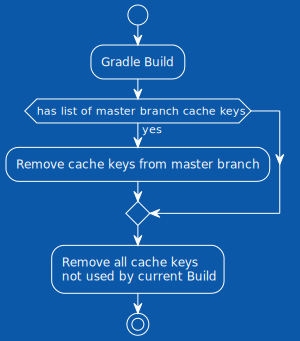

+++
title = "Gradle + GitLab: эффективный и бесплатный билд-кэш"
date = "2024-07-27"

[taxonomies]
tags = ["gradle", "gitlab", "android", "docker"]
+++

# Контекст

Эта заметка является чем-то вроде гайда по бюджетной настройке GitLab кэшей для Gradle в Android проектах без использования Gradle Enterprise и Remote Build Cache. В интернете маловато текстовых материалов о том, как настраивать кэши Gradle на CI, и еще меньше о том, как это делать правильно. В придачу, когда кто-то задает правильные вопросы в Gradle Slack, на форуме Gradle или на StackOverflow, прибегают увлажняемые из Gradle и рекомендуют не копать в нужную сторону, а просто купить Gradle Enterprise (или как он там щас называется).

У меня есть опыт выстраивания билд-инфраструктуры в большом коммерческом Android-проекте. И я хочу поделиться лайфхаками с теми, кто только начинает заниматься оптимизациями билда на CI в своем проекте.

# Проблема

> Проблема в том, что Gradle говно <br/> — Джейсон Стэтхэм

Каждый уважающий себя проект имеет хотя бы простейшую систему CI/CD, чаще всего в GitLab. С ростом проекта увеличивается и время ожидания прогонов сборок/тестов/линтера и т.д. В какой-то момент время ожидания проверки вашего МР переваливает за все допустимые границы и приходит желание что-то с этим делать.

# Решение

Предлагаемое мною решение работает на проектах величиной до 500 модулей. Если у вас модулей больше, скорее всего вы знаете лучше меня как оптимизировать билды. 

Говоря "500 модулей" я имею ввиду 500 модулей из [замечательного доклада Степана Гончарова](https://www.youtube.com/watch?v=oAQlKiF91Ks).

## Проверяем что базовые вещи сделаны правильно

### Разделение пайплайнов по предназначению

> Генерируйте кэш в одних пайплайнах, используйте его в других.

В первую очередь надо понять, что загрузка и сохранение кэша в GitLab, это не бесплатный по времени процесс. Чем больше весит кэш, тем дольше он упаковывается в архив и отгружается в облако. Даже Gradle Remote Build Cache не бесплатная штука, особенно если вы используете стандартный Remote Build Cache плагин и официальную Docker ноду. Поэтому в базовой реализации не все пайплайны должны генерировать кэш.

Предлагаемая мною схема такая:
- У проекта есть основная ветка, пусть она называется `master`. 
- Есть `feature`-ветки, которые в конце своей жизни вливаются в `master`.
- При вливании в `master` запускается пайп, генерирующей билд кэш. Если не хочется запускать при вливании, запускаем по расписанию.
- Когда запускаются пайплайны на `feature`-ветках, они используют кэш сгенерированный на ветке `master`. 


### Разделение GitLab кэшей по предназначению

> Кэшировать билд-кэш, зависимости и Gradle Wrapper нужно отдельными ключами

В проекте чаще всего меняется код продукта, немного реже меняются зависимости, и еще реже меняется версия Gradle. Я считаю что кэш для этих сущностей должен быть отдельный. Суммарный вес архива с общим кэшом быстро превысит допустимые для отгрузки по s3 лимиты. К тому же джобы, которым нужны не все виды кэша, будут выполнятся быстрее если не будут грузить ничего лишнего.


Все что надо кэшировать на CI, Gradle хранит в директории `$GRADLE_USER_HOME`. Вы можете переопределить эту переменную окружения для джоб:

```yaml
some job:
  variables:
    GRADLE_USER_HOME: $CI_PROJECT_DIR/.gradle
```

Далее во всех примерах я буду считать что `$GRADLE_USER_HOME` именно такой.

```shell
$GRADLE_USER_HOME/
├── caches/
│   ├── build-cache-1/ <- Билд-кэш
│   └── modules-2/ <- кэш зависимостей
├── notifications/ <- мусор для wrapper
└── wrapper/ <- дистрибутивы wrapper
```

### Отдельный GitLab кэш для Gradle Wrapper

Дистрибутивы Gradle хранятся в `$GRADLE_USER_HOME/wrapper/`, а дополнительный мусор от него хранится в `$GRADLE_USER_HOME/notifications/`. Хорошо бы для этих сущностей выделить отдельные GitLab cache key:

```yaml
# cache.yml

.pull-wrapper-cache:
  - key: cache-wrapper
    policy: pull
    unprotect: true
    paths:
      - .gradle/wrapper/
      - .gradle/notifications/

.pull-push-wrapper-cache:
  - key: cache-wrapper
    policy: pull-push
    unprotect: true
    paths:
      - .gradle/wrapper/
      - .gradle/notifications/
```

Тогда в джобах, которые генерируют билд-кэш, мы можем указывать:

```yaml
cache build:
  ...
  cache:
    - !reference [ .pull-push-wrapper-cache ]
```

В документации Gradle сказано что неиспользуемые версии дистрибутивов удаляются автоматически через какое-то время. Поверим им на слово. Кэш с дистрибутивами не должен разрастаться слишком сильно.

В джобах, которые только потребляют билд-кэш, можно указывать:

```yaml
lint:
  ...
  cache:
    - !reference [ .pull-wrapper-cache ]
```

Дистрибутивы Gradle не весят много, поэтому архивы с ними будут загружаться в джобу быстро.

### Отдельный GitLab кэш для зависимостей

Зависимости это AAR и JAR артефакты всех либ и плагинов используемых в проекте. Gradle их хранит в `$GRADLE_USER_HOME/caches/modules-2/`. Выделяем расширения для работы с кэшами зависимостей:

```yaml
# cache.yml

.pull-deps-cache:
  - key: cache-deps
    policy: pull
    unprotect: true
    paths:
      - .gradle/caches/modules-2/

.push-deps-cache:
  - key: cache-deps
    policy: push
    unprotect: true
    paths:
      - .gradle/caches/modules-2/
```

Тогда в джобах, которые генерируют билд-кэш, мы можем указывать:

```yaml
cache build:
  ...
  cache:
    - !reference [ .push-deps-cache ]
```

Как можно заметить, джоба для генерации кэша вообще не получает зависимостей при старте и всегда качает их заново. Объясняю это дальше.

В джобах, которые только потребляют билд-кэш, можно указывать:

```yaml
lint:
  ...
  cache:
    - !reference [ .pull-deps-cache ]
```

Зависимости проекта весят больше, чем дистрибутивы, но меньше чем билд кэш.

### Отдельный GitLab кэш для Gradle build cache

Самая тяжелая часть кэша — билд-кэш.

Билд-кэш хранится в `$GRADLE_USER_HOME/caches/build-cache-1/`. Вложенных директорий внутри нет, там просто огромная простыня с бинарными файлами. Создаем расширения для работы с билд-кэшом:

```yaml
# cache.yml

.pull-build-cache:
  - key: cache-build
    policy: pull
    unprotect: true
    paths:
      - .gradle/caches/build-cache-1/

.push-build-cache:
  - key: cache-build
    policy: push
    unprotect: true
    paths:
      - .gradle/caches/build-cache-1/
```

Джоба генерации кэша выглядит вот так:

```yaml
cache build:
  ...
  cache:
    - !reference [ .push-build-cache ]
```

И снова джоба для генерации кэша предыдущую версию кэша не получает. Объясняю это дальше.

Джобы потребляющие билд кэш получают вот такую запись:

```yaml
test:
  ...
  cache:
    - !reference [ .pull-build-cache ]
```

### Собираем все вместе

Если собрать все воедино, то может получиться что-то такое:

```yaml
.base:
  variables:
    GRADLE_USER_HOME: $CI_PROJECT_DIR/.gradle
  # Тут какие-то еще базовые настройки, которые я пропустил
  before_script:
    - ...
  after_script:
    - ...

# Эта джоба запускается в МРе
build:
  stage: check
  extends: .base
  script:
    - ./gradlew :app:assembleDebug
  cache:
    - !reference [ .pull-wrapper-cache ]
    - !reference [ .pull-deps-cache ]
    - !reference [ .pull-build-cache ]
  rules:
    - if: $CI_PIPELINE_SOURCE = "merge_request_event"

# Эта джоба запускается после вливания МРа
cache build:
  stage: post-check
  extends: .base
  script:
    - ./gradlew :app:assembleDebug
  cache:
    - !reference [ .pull-push-wrapper-cache ]
    - !reference [ .push-deps-cache ]
    - !reference [ .push-build-cache ]
  rules:
    - if: $CI_PIPELINE_SOURCE = "push" && $CI_COMMIT_BRANCH == "master"
```

На данном этапе сборка в прогонах МРа будет уже заметно ускорена. Но как любят говорить соевые айтишники, "тут есть точки роста".


Джобе cache build не дается кэш от ее предыдущих запусков. То есть билд и закачка зависимостей в этой джобе происходит каждый раз с нуля. Все потому что Gradle самостоятельно не очищает неиспользуемый кэш и зависимости. Если для генерации нового кэша мы будем использовать результаты прошлых прогонов, то кэш будет разрастаться с огромной скоростью. Он быстро перевалит за критическую отметку в 5 гигабайт, после чего вы даже не сможете загрузить его в хранилище s3. Короче, это просто такой способ защититься от неконтролируемого роста GitLab кэша.

Полное отсутствие билд-кэша приводит к долгим прогонам. Настолько долгим, что стоит задуматься, а целесообразно ли генерить кэш при каждом вливании в master, или все-таки лучше делать это по расписанию?

Если бы мы только могли сами очищать ненужные cache entry в директории `$GRADLE_USER_HOME/caches/build-cache-1/`, было бы супер удобно, мммм?

### Упс, купите Gradle Enterprise

Нужный нам функционал уже есть в Gradle Enterprise, но за него у вас могут попросить деняк. А если вы работаете в Богом хранимой, то вас еще могут попросить пойти нахуй. Вручную посмотреть использованные кэш-ключи Gradle можно при помощи опции `--scan`. Но автоматизировать сбор и парсинг этих данных на CI проблематично. Про то как сломать Gradle Enterprise плагин и заставить его делиться билд сканами я напишу отдельную заметку. Для текущей заметки нашел более простой способ решить проблему.

<center>


</center>

Бизнес-модель Gradle построена на ненависти к людям, мы такое осуждаем, поэтому деняк им не дадим. Давайте без Enterprise версии будем вытаскивать кэш-ключи от билдов на CI.

## Вытаскиваем кэш-ключи

Для того чтобы получить доступ к кэш-ключам, нам придется использовать gradle internal api. Хорошее объяснение того, что мы дальше делаем, есть в [докладе от Тинькофф на Mobius Spring 2024](https://mobiusconf.com/en/archive/2024%20Spring/talks/f9f7e56446a7462eb8e3e4ba6cc64770/?referer=%2Fen%2Farchive%2F2024%2520Spring%2Fpartners%2F42a2ee1c-85c9-4ceb-ba77-a0fe87f91cec%2F).

### Пишем BuildService

Реализуем свой сервис, который подписывается на все билд-операции и в конце билда выгружает список кэш-ключей в файл:

```kotlin
internal abstract class CacheKeysHandlerService :
    BuildService<CacheKeysHandlerService.Params>,
    BuildOperationListener,
    AutoCloseable {

    interface Params : BuildServiceParameters {
        val cacheKeysFile: RegularFileProperty
    }

    private val cacheKeys: MutableSet<String> = ConcurrentHashMap.newKeySet()

    override fun started(descriptor: BuildOperationDescriptor, event: OperationStartEvent) {
        /* no-op */
    }

    override fun progress(identifier: OperationIdentifier, event: OperationProgressEvent) {
        /* no-op */
    }

    override fun finished(descriptor: BuildOperationDescriptor, event: OperationFinishEvent) {
        when (val details = descriptor.details) {
            // cохранение в кэш (локальный и remote)
            is StoreOperationDetails -> cacheKeys += details.cacheKey
            // загрузка из кэша (локального и remote)
            is LoadOperationDetails -> cacheKeys += details.cacheKey
            // сериализация кэша
            is PackOperationDetails -> cacheKeys += details.cacheKey
            // десериализация кэша
            is UnpackOperationDetails -> cacheKeys += details.cacheKey
        }
    }

    override fun close() {
        parameters.cacheKeysFile.get().asFile.bufferedWriter().use { writer ->
            for (key in cacheKeys) {
                writer.appendLine(key)
            }
        }
    }
}
```

Объясняю что происходит:
1. Все сервисы Gradle работающие на фоне во время билда должны реализовывать интерфейс `BuildService<*>`. Интерфейс `Params` является "внешним API" для нашего сервиса.
2. `BuildOperationListener` мы реализуем для того чтобы подписаться на все билд-операции Gradle. Это интерфейс из пакета `internal`. К сожалению аналогичный "listener" из публичного API не дает возможности посмотреть на кэш-ключи.
3. Интерфейс `AutoCloseable` для того чтобы реализовать метод `close()`. Он вызовется в конце билда. Именно там мы должны будем обработать собранные за все время билда данные.
4. Поле `cacheKeys: MutableSet<String>`. Тут аккумулируем кэш-ключи. Важно что `BuildOperationListener` не является потокобезопасным, нам нельзя блочить его работу, и нужно самостоятельно обрабатывать многопоточный вызов его методов. Поэтому для реализации `cacheKeys` используем коллекцию из `java.util.concurrent`.
5. Из всех методов колбека `BuildOperationListener` нам нужно реализовать только `finished`. В него прилетают интересующие нас события, в том числе события обработки кэш-ключей. Кэш-ключи могут повторяться, поэтому у нас Set. Мониторим все возможные события для надежности.

Подключаем созданный нами сервис при помощи convention-плагина:

```kotlin
@Suppress("unused", "UnstableApiUsage")
internal abstract class CacheKeysHandlerPlugin @Inject constructor(
    providers: ProviderFactory,
    layout: BuildLayout,
    private val registryInternal: BuildEventListenerRegistryInternal,
) : Plugin<Settings> {

    /** По-умолчанию плагин выключен, врубаем его только на CI */
    private val enabled = providers
        .gradleProperty("com.example.build.cache-keys.enabled")
        .map { it.toBoolean() }
        .getOrElse(false)

    /** Можем указать кастомный путь до output-файла с кэш-ключами */
    private val cacheKeysFile = providers
        .gradleProperty("com.example.build.cache-keys.file-name")
        .orElse("cache-keys.txt")
        // Когда мы указываем путь через layout, а не через java.io.File,
        // Gradle сам создает файл на старте билда.
        .map { layout.rootDirectory.file(it) }

    override fun apply(target: Settings): Unit = with(target) {
        if (!enabled) return

        val serviceProvider = gradle.sharedServices.registerIfAbsent(
            "cache-keys-handler-service",
            CacheKeysHandlerService::class.java,
        ) { spec ->
            with(spec) {
                parameters.cacheKeysFile.set(cacheKeysFile)
            }
        }
        registryInternal.onOperationCompletion(serviceProvider)
    }
}
```

> Список того что можно инжектить в конструкторы плагинов и сервисов: [Understanding Services and Service Injection](https://docs.gradle.org/current/userguide/service_injection.html).

Подключаем этот convention-плагин в `settings.gradle` файле вашего проекта. На этом собственно самая сложная часть закончилась.

> Важно заметить, что этот способ на 100% работает только при выполнении двух условий:
> 1. Когда нет тасок UP-TO-DATE. Потому что если таска UP-TO-DATE, Gradle не использует механизм build caching и отследить кэш-ключи становится на порядок сложнее.
> 2. Когда отключен Configuration Cache.
> 
> На CI в чистых контейнерах такой проблемы нет и configuration cache там отключен (отключен же, да?). 
> 
> Локально при тестировании функционала это надо учитывать. Перед тестами вызывать `./gradlew clean`, чтобы удалить `build` директории во всех модулях, а также использовать аргумент `--no-configuration-cache`. 
> Подробнее про [отличия UP-TO-DATE и FROM-CACHE](https://stackoverflow.com/questions/65101472/what-is-the-difference-between-from-cache-and-up-to-date-in-gradle).

## Докручиваем базовое решение

### Переиспользуем билд кэш для генерации нового кэша

Так как мы теперь знаем, какие кэш-ключики были использованы во время билда, мы можем спокойно дропать все остальные. Так мы в разы ускоряем прогон пайплайна для генерации кэша:


На картинке все выглядит красиво, осталось это реализовать. Давайте допилим наш `CacheKeysHandlerService` функцией удаления неиспользованного билд-кэша:

```kotlin
internal abstract class CacheKeysHandlerService @Inject constructor(
    gradle: Gradle, // это тоже добавляем
) :
    BuildService<CacheKeysHandlerService.Params>,
    BuildOperationListener,
    AutoCloseable {

    // написанный ранее код...

    private val buildCacheDir: File = checkNotNull(gradle.gradleHomeDir)
        .resolve("caches/build-cache-1")

    override fun close() {
        // написанный ранее код...
        
        // Удаляем все кэш-ключи, не вошедшие в текущий билд
        val unusedCacheKeys = iterateBuildCache { it !in cacheKeys }
        for (key in unusedCacheKeys) {
            check(buildCacheDir.resolve(key).delete()) {
                "Unable to delete cache key file: $key"
            }
        }
    }

    private fun iterateBuildCache(selector: (String) -> Boolean): Array<out File> =
        buildCacheDir
            .listFiles { file -> selector(file.name) }
            .orEmpty()
}
```

Теперь мы можем немного поправить наш GitLab Yaml конфиг. Во-первых, добавить новый конфиг для кэша:

```yaml
# cache.yml

.pull-push-build-cache:
  - key: cache-build
    policy: pull-push
    unprotect: true
    paths:
      - .gradle/caches/build-cache-1/
```

Во-вторых использовать этот конфиг в джобе генерации кэша:

```yaml
...

# Эта джоба запускается после вливания МРа
cache build:
  stage: post-check
  extends: .base
  script:
    - ./gradlew :app:assembleDebug
  cache:
    - !reference [ .pull-push-wrapper-cache ]
    - !reference [ .push-deps-cache ]
    - !reference [ .pull-push-build-cache ]
  rules:
    - if: $CI_PIPELINE_SOURCE = "push" && $CI_COMMIT_BRANCH == "master"
```

Теперь можно не бояться обновлять кэш при каждом вливании в `master`, ибо это будет происходить быстро. Чем чаще обновляем кэш, тем выше cache-hit в пайплайнах наших МРов. При условии что мы не забываем периодически их ребейзить и держать up-to-date с главной веткой.

#### А можно ли так же с кэшом зависимостей?

Да можно, но это тема отдельной текстовой карточки. Есть лайфкек, называется "Перчатка Таноса". Работает следующим образом: используем `policy: pull-push` для GitLab кэша зависимостей; при этом на старте джобы удаляем 50% рандомных пакетов в `$GRADLE_USER_HOME/caches/modules-2/`. Отлично работающий на практике способ.

<center>


</center>

### Переиспользуем билд кэш MR-ов в пайплайнах MR-ов

> Это уже задача со звездочкой. 

Можно еще сильнее ускорить прогон пайплайнов в МРах, если переиспользовать в каждом новом прогоне кэш, сгенерированный в предыдущем.
Для этого мы должны передавать между джобами как можно меньше данных. На скачивание и отгрузку кэша не должно уходить больше времени, чем на полезную работу внутри джобы.


Грубо говоря, после каждого прогона джобы на МРе мы должны:
1. Удалить все кэш-ключи, которые **ЕСТЬ** в ветке master. Потому что в следующий раз мы снова их спокойно подтянем из master.
2. Удалить все кэш-ключи, которые оказались **НЕ ЗАДЕЙСТВОВАНЫ** в текущем билде. Потому что если мы их не юзали, в следующий раз они скорее всего не понадобятся.

Получается следующая схема:

<center>

</center>

После такой чистки в директории `caches/build-cache-1` ~~<sup>начался сущий кошмар</sup>~~ останется дистиллят, который будет достаточно легким для отгрузки/загрузки во время подготовки GitLab раннера. Но при этом будет достаточен для заметного ускорения следующего прогона.

#### Вакуумирование кэша (дистиллят)

Для описанной выше схемы чистки кэша, состоящей из двух шагов, нужно допилить метод `close()` в `CacheKeysHandlerService`:

```kotlin
internal abstract class CacheKeysHandlerService @Inject constructor(
    gradle: Gradle,
) :
    BuildService<CacheKeysHandlerService.Params>,
    BuildOperationListener,
    AutoCloseable {

    // написанный ранее код...

    override fun close() {
        val cacheKeysFile = parameters.cacheKeysFile.asFile.get()

        // Если файл с ключами не пустой, значит мы специально подсунули его на CI
        // В файле хранится список ключей прилетевших с master ветки, удаляем их
        cacheKeysFile.useLines { snapshotCacheKeys ->
            for (key in snapshotCacheKeys) {
                check(buildCacheDir.resolve(key).delete()) {
                    "Unable to delete cache key file: $key"
                }
            }
        }

        // Записываем в файл новые ключики, дальше на CI разберутся что с ними делать
        cacheKeysFile.bufferedWriter().use { writer ->
            for (key in cacheKeys) {
                writer.appendLine(key)
            }
        }

        // Удаляем все кэш-ключи, не вошедшие в текущий билд
        val unusedCacheKeys = iterateBuildCache { it !in cacheKeys }
        for (key in unusedCacheKeys) {
            check(buildCacheDir.resolve(key).delete()) {
                "Unable to delete cache key file: $key"
            }
        }
    }
}
```

#### Передаем список кэш-ключей из master в МРы

Джоба, генерирующая кэш на CI, что гоняется при мерже в мастер, теперь будет отгружать архив не только с содержимым директории `$GRADLE_USER_HOME/caches/build-cache-1`, но и файлик `cache-keys.txt`. Джобы, запускаемые в МРах, будут чистить свой кэш от лишних ключей ориентируясь на этот файл. То, что останется, будет сохраняться для дальнейших прогонов:


Редактируем определение билд-кэша в GitLab:

```yaml
# cache.yml

.pull-build-cache:
  - key: cache-build
    policy: pull
    unprotect: true
    paths:
      - .gradle/caches/build-cache-1/
      - cache-keys.txt  # <-- Добавили

# Удаляем .push-build-cache
# Добавляем вот это:
.pull-push-build-cache:
  - key: cache-build
    policy: pull-push
    unprotect: true
    paths:
      - .gradle/caches/build-cache-1/
      - cache-keys.txt  # <-- Добавили

# Добавляем определение для "branch specific cache"
.pull-push-branch-specific-cache:
  - key: "$CI_JOB_NAME-$CI_COMMIT_REF_SLUG"
    policy: pull-push
    unprotect: true
    paths:
      - .gradle/caches/build-cache-1/
      # А вот тут нет `cache-keys.txt`, это важно

```

Применяем новые кэши к нашим джобам:

```yaml
.base:
  variables:
    GRADLE_USER_HOME: $CI_PROJECT_DIR/.gradle
  # Тут какие-то еще базовые настройки, которые я пропустил
  before_script:
    # Врубаем наш плагин! А то ничо не заработает
    - mkdir -p $GRADLE_USER_HOME
    - echo "com.example.build.cache-keys.enabled=true" >> $GRADLE_USER_HOME/gradle.properties
    - ...
  after_script:
    - ...

# Эта джоба запускается в МРе
build:
  stage: check
  extends: .base
  script:
    - ./gradlew :app:assembleDebug
  cache:
    - !reference [ .pull-wrapper-cache ]
    - !reference [ .pull-deps-cache ]
    - !reference [ .pull-build-cache ]
    - !reference [ .pull-push-branch-specific-cache ]  # <-- Добавили
  rules:
    - if: $CI_PIPELINE_SOURCE = "merge_request_event"

# Эта джоба запускается после вливания МРа
cache build:
  stage: post-check
  extends: .base
  script:
    - ./gradlew :app:assembleDebug
  cache:
    - !reference [ .pull-push-wrapper-cache ]
    - !reference [ .push-deps-cache ]
    - !reference [ .push-push-build-cache ]  # <-- Изменили
  rules:
    - if: $CI_PIPELINE_SOURCE = "push" && $CI_COMMIT_BRANCH == "master"
```

#### Запускаем и убеждаемся, что все работает

Теперь при создании МРа, первый прогон джобы build будет использовать кэш из ветки master. Чем ближе ваша ветка к ветке master, тем выше будет cache-hit.

При повторных прогонах МРа в дополнение к кэшу из master будет использован и кэш из предыдущего прогона.

## Как это дебажить?

Нельзя верить мне на слово. Если вдруг появится жгучее желание не просто скопировать код отсюда, но и убедиться в том что он работает, можно проверить работу плагина локально. Для локальной отладки рекомендую указать альтернативный путь для переменной окружения `$GRADLE_USER_HOME`. По дефолту, если переменная не указна, Gradle хранит данные в `$USER_HOME/.gradle`, и при отладке ты будешь дропать билд кэш вообще всех проектов что есть у тебя на компуктере.

Также напоминаю, что во время отладки нужно отключать configuration cache и перед каждым замером чистить build директории модулей через твой любимый bash скрипт либо через `./gradlew clean`.

Подготовительная работа перед измерением качества работы плагина следующая:

0. Включаешь плагин через `gradle.properties`: 
    ```properties
    com.example.build.cache-keys.enabled=true
    ```
1. Удаляешь файлик `cache-keys.txt`, если он есть.
2. Собираешь проект с опцией `--scan`.
4. Удаляешь файлик `cache-keys.txt`.
3. Чистишь build директории.
4. Удаляешь файлик `cache-keys.txt`.

После этих шагов у тебя будет билд-кэш, из которого удалены ВСЕ ключи, кроме использованных в билде. Файлик с ключами мы удаляем чтобы в в каждом следующем билде наш плагин не дропал ключи из него, думая что это ключи из master ветки.

Собственно, измерения:
1. Собираешь проект с опцией `--scan`. На том кэше который остался после чистки с прошлого билда.
2. Открываешь BuildScan и смотришь Cache Hit. Он должен быть 100% (либо более 95%, если есть какие-то проблемы с кэш-миссами).

Информацию о проценте попаданий в кэш тоже можно собирать с помощью плагина, но это тема уже раскрыта в [докладе от Тинькофф на Mobius Spring 2024](https://mobiusconf.com/en/archive/2024%20Spring/talks/f9f7e56446a7462eb8e3e4ba6cc64770/?referer=%2Fen%2Farchive%2F2024%2520Spring%2Fpartners%2F42a2ee1c-85c9-4ceb-ba77-a0fe87f91cec%2F).

# Итоги

## Какие есть минусы у решения и что можно доработать?

### Не реализована очистка кэша зависимостей

Делается аналогично, но механизм отслеживания артефактов и чистка директорий с ними сложнее в реализации и требует больше кода. Возможно об этом я тоже напишу заметку в будущем. 

**Важно:** текущего решения уже более чем достаточно даже для средних по размерам проектов. 

### Последовательные запуски gradle ломают логику

Я хотел продемонстрировать суть своего решения. Дополнительная логика очистки докручивается без проблем.

### Накапливаем список всех ключей в оперативной памяти

Это правда может стать проблемой, если ключей будет много. Но я сознательно пошел на этот шаг из-за того что большая часть тасок вообще не поддерживает кэширование через build cache. По моим наблюдениям список кэш-ключей на проекте из 500 модулей может занимать до 200 килобайт памяти, поэтому смысла оптимизировать этот момент нет.

### Сложна

А кому щас легко...

## О хорошем

Представленное здесь решение можно считать одним из самых простых способов значительно сократить билд-тайм на CI, используя только бесплатные инструменты и не погружаясь в impact-анализ. В общем, топ за свои деньги.