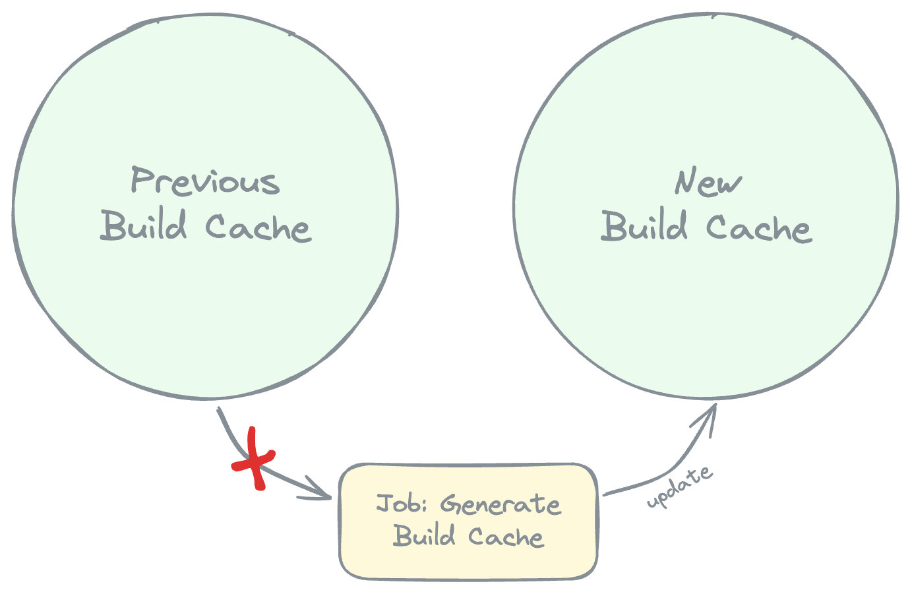

+++
title = "Gradle + GitLab: эффективный и бесплатный билд-кэш"
date = "2024-03-10"
draft = true

[taxonomies]
tags = ["gradle", "gitlab", "android", "docker"]
+++

# Контекст

Эта заметка является чем-то вроде гайда по бюджетной настройке кэшей в Gradle проектах без использования Gradle Enterprise и Remote Build Cache. В интернете маловато текстовых материалов о том, как настраивать кэши Gradle на CI, и еще меньше о том, как это делать правильно. В придачу, когда кто-то задает правильные вопросы в Gradle Slack, на форуме Gradle или на StackOverflow, прибегают пидарасы из Gradle и рекомендуют не копать в нужную сторону, а просто купить Gradle Enterprise.

У меня есть опыт выстраивания билд-инфраструктуры в большом коммерческом Android-проекте. И я хочу поделиться лайфкеками с теми, кто только начинает заниматься оптимизациями билда в своем проекте.

# Проблема

> Проблема в том, что Gradle говно <br/> — Джейсон Стэтхэм

Каждый уважающий себя проект имеет хотя бы простейшую систему CI/CD, чаще всего в GitLab. С ростом проекта увеличивается и время ожидания прогонов сборок/тестов/линтера и т.д. В какой-то момент время ожидания проверки вашего МР переваливает за все допустимые границы и приходит желание что-то с этим делать.

# Решение

Предлагаемое мною решение работает на проектах величиной до 500 модулей. Если у вас модулей больше, скорее всего вы знаете лучше меня как оптимизировать билды. 

Говоря "500 модулей" я имею ввиду 500 модулей из [замечательного доклада Степана Гончарова](https://www.youtube.com/watch?v=oAQlKiF91Ks).

## Проверяем что базовые вещи сделаны правильно

### Разделение пайплайнов по предназначению

> Генерируйте кэш в одних пайплайнах, переиспользуйте его в других.

В первую очередь надо понять, что загрузка и сохранение кэша в GitLab, это не быстрый процесс. Чем больше весит кэш, тем дольше он упаковывается в архив и отгружается в облако. Даже Gradle Remote Build Cache не бесплатная штука, особенно если вы используете стандартный Remote Build Cache плагин и официальную Docker ноду. Поэтому в базовой реализации не все пайплайны должны генерировать кэш.

Предлагаемая мною схема такая:
- У проекта есть основная ветка, пусть она называется `master`. 
- Есть `feature`-ветки, которые в конце своей жизни вливаются в `master`.
- При вливании в `master` запускается пайп, генерирующей билд кэш. Если не хочется запускать при вливании, запускаем по расписанию.
- Когда запускаются пайплайны на `feature`-ветках, они переиспользуют кэш сгенерированный на ветке `master`. 


### Разделение GitLab кэшей по предназначению

> Кэшировать билд-кэш, зависимости и Gradle Wrapper нужно отдельными ключами

В проекте чаще всего меняется код продукта, немного реже меняются зависимости, и еще реже меняется версия Gradle. Я считаю что кэш для этих сущностей должен быть отдельный. Суммарный вес архива с общим кэшом быстро превысит допустимые для отгрузки по s3 лимиты. К тому же джобы, которым нужны не все виды кэша, будут выполнятся быстрее если не будут грузить ничего лишнего.


Все что надо кэшировать на CI, Gradle хранит в директории `$GRADLE_USER_HOME`. Вы можете переопределить эту переменную окружения для джоб:

```yaml
some job:
  variables:
    GRADLE_USER_HOME: $CI_PROJECT_DIR/.gradle
```

Далее во всех примерах я буду считать что `$GRADLE_USER_HOME` именно такой.

```shell
$GRADLE_USER_HOME/
├── caches/
│   ├── build-cache-1/ <- Билд-кэш
│   └── modules-2/ <- кэш зависимостей
├── notifications/ <- мусор для wrapper
└── wrapper/ <- дистрибутивы wrapper
```

### Отдельный GitLab кэш для Gradle Wrapper

Дистрибутивы Gradle хранятся в `$GRADLE_USER_HOME/wrapper/`, а дополнительный мусор от него хранится в `$GRADLE_USER_HOME/notifications/`. Хорошо бы для этих сущностей выделить отдельные GitLab cache key:

```yaml
# cache.yml

.pull-wrapper-cache:
  - key: cache-wrapper
    policy: pull
    unprotect: true
    paths:
      - .gradle/wrapper/
      - .gradle/notifications/

.pull-push-wrapper-cache:
  - key: cache-wrapper
    policy: pull-push
    unprotect: true
    paths:
      - .gradle/wrapper/
      - .gradle/notifications/
```

Тогда в джобах, которые генерируют билд-кэш, мы можем указывать:

```yaml
cache build:
  ...
  cache:
    - !reference [ .pull-push-wrapper-cache ]
```

В документации Gradle сказано что неиспользуемые версии дистрибутивов удаляются автоматически через какое-то время. Поверим им на слово. Кэш с дистрибутивами не должен разрастаться слишком сильно.

В джобах, которые только потребляют билд-кэш, можно указывать:

```yaml
lint:
  ...
  cache:
    - !reference [ .pull-wrapper-cache ]
```

Дистрибутивы Gradle не весят много, поэтому архивы с ними будут загружаться в джобу быстро.

### Отдельный GitLab кэш для зависимостей

Зависимости это AAR и JAR артефакты всех либ и плагинов используемых в проекте. Gradle их хранит в `$GRADLE_USER_HOME/caches/modules-2/`. Выделяем расширения для работы с кэшами зависимостей:

```yaml
# cache.yml

.pull-deps-cache:
  - key: cache-deps
    policy: pull
    unprotect: true
    paths:
      - .gradle/caches/modules-2/

.push-deps-cache:
  - key: cache-deps
    policy: push
    unprotect: true
    paths:
      - .gradle/caches/modules-2/
```

Тогда в джобах, которые генерируют билд-кэш, мы можем указывать:

```yaml
cache build:
  ...
  cache:
    - !reference [ .push-deps-cache ]
```

Как можно заметить, джоба для генерации кэша вообще не получает зависимостей при старте и всегда качает их заново. Объясняю это дальше.

В джобах, которые только потребляют билд-кэш, можно указывать:

```yaml
lint:
  ...
  cache:
    - !reference [ .pull-deps-cache ]
```

Зависимости проекта весят больше, чем дистрибутивы, но меньше чем билд кэш.

### Отдельный GitLab кэш для Gradle build cache

Самая тяжелая часть кэша — билд-кэш.

Билд-кэш хранится в `$GRADLE_USER_HOME/caches/build-cache-1/`. Вложенных директорий внутри нет, там просто огромная простыня с бинарными файлами. Создаем расширения для работы с билд-кэшом:

```yaml
# cache.yml

.pull-build-cache:
  - key: cache-build
    policy: pull
    unprotect: true
    paths:
      - .gradle/caches/build-cache-1/

.push-build-cache:
  - key: cache-build
    policy: push
    unprotect: true
    paths:
      - .gradle/caches/build-cache-1/
```

Джоба генерации кэша выглядит вот так:

```yaml
cache build:
  ...
  cache:
    - !reference [ .push-build-cache ]
```

И снова можно заметить что джоба для генерации кэша предыдущую версию кэша не получает. Объясняю это дальше.

Джобы потребляющие билд кэш получают вот такую запись:

```yaml
test:
  ...
  cache:
    - !reference [ .pull-build-cache ]
```

### Собираем все вместе

Если собрать все воедино, то может получиться что-то такое:

```yaml
.base:
  variables:
    GRADLE_USER_HOME: $CI_PROJECT_DIR/.gradle
  # Тут какие-то еще базовые настройки, которые я пропустил
  before_script:
    - ...
  after_script:
    - ...

# Эта джоба запускается в МРе
build:
  stage: check
  extends: .base
  script:
    - ./gradlew :app:assembleDebug
  cache:
    - !reference [ .pull-wrapper-cache ]
    - !reference [ .pull-deps-cache ]
    - !reference [ .pull-build-cache ]
  rules:
    - if: $CI_PIPELINE_SOURCE = "merge_request_event"

# Эта джоба запускается после вливания МРа
cache build:
  stage: post-check
  extends: .base
  script:
    - ./gradlew :app:assembleDebug
  cache:
    - !reference [ .pull-push-wrapper-cache ]
    - !reference [ .push-deps-cache ]
    - !reference [ .push-build-cache ]
  rules:
    - if: $CI_PIPELINE_SOURCE = "push" && $CI_COMMIT_BRANCH == "master"
```

На данном этапе сборка в прогонах МРа будет уже заметно ускорена. Но как любят говорить соевые айтишники, "тут есть точки роста".



Можно заметить, джобе `cache build` не дается кэш от ее предыдущих запусков. То есть билд и закачка зависимостей в этой джобе происходит каждый раз с нуля. Все потому что Gradle самостоятельно не очищает неиспользуемый кэш и зависимости. Если для генерации нового кэша мы будем использовать результаты прошлых прогонов, то кэш будет разрастаться с огромной скоростью. Он быстро перевалит за критическую отметку в 5 гигабайт, после чего вы даже не сможете загрузить его в хранилище s3. Короче, это просто такой способ защититься от неконтролируемого роста GitLab кэша.

С перезагрузкой зависимостей все не так критично, это происходит достаточно быстро. А вот полное отсутствие билд-кэша приводит к реально долгим прогонам. Настолько долгим, что стоит задуматься, а целесообразно ли генерить кэш при каждом вливании в `master`, или все-таки лучше делать это по расписанию?

Если бы мы только могли сами очищать ненужные cache entry в директории `$GRADLE_USER_HOME/caches/build-cache-1/`, было бы супер удобно, мммм?

### Упс, купите Gradle Enterprise

Нужный нам функционал уже есть в Gradle Enterprise, но за него у вас могут попросить деняк. А если вы работаете в Богом хранимой, то вас еще могут попросить пойти нахуй. Вручную посмотреть использованные кэш-ключи Gradle можно при помощи опции `--scan`. Но автоматизировать сбор и парсинг этих данных на CI проблематично. Про то как сломать Gradle Enterprise плагин и заставить его делиться билд сканами я напишу отдельную заметку. Для текущей заметки нашел более простой способ решить проблему.

<center>


</center>

Бизнес-модель Gradle построена на ненависти к людям, мы такое осуждаем, поэтому деняк им не дадим. Давайте без Enterprise версии будем вытаскивать кэш-ключи от билдов на CI.

## Вытаскиваем кэш-ключи

Сохранением и извлечением билд кэша в Gradle занимаются `BuildCacheService`. Если мы создадим свою реализацию такого сервиса, то сможем записать все использованные в текущем билде ключики. А потом конечно сможем очистить ту часть кэша, которая не была использована.

[Документация по BuildCacheService](https://docs.gradle.org/current/javadoc/org/gradle/caching/BuildCacheService.html) достаточно скудная, поэтому когда я разбирался в теме, подсматривал в исходники Gradle и в реализацию [Gradle Redis build cache](https://github.com/tehlers/gradle-redis-build-cache).

### Притворяемся Remote Build Cache

Реализуем свой сервис, прикидывающийся сервисом для Remote Build Cache. Gradle будет давать нам ключи кэша для того чтобы мы их сохранили, но мы будем просто запоминать их:

```kotlin
internal class CraftyBuildCacheService(
    private val configuration: CraftyBuildCacheConfig,
    private val objects: ObjectFactory,
) : BuildCacheService {

    private val storedCacheKeySet: MutableSet<String> = ConcurrentHashMap.newKeySet()

    override fun load(key: BuildCacheKey, reader: BuildCacheEntryReader): Boolean {
        storedCacheKeySet.add(key.displayName)
        return false
    }

    override fun store(key: BuildCacheKey, writer: BuildCacheEntryWriter) {
        storedCacheKeySet.add(key.displayName)
    }

    override fun close() {
        println("${storedCacheKeySet.size} cache keys collected.")
        // Делайте с этой инфой все что хотите :)))
    }
}
```

Класс для хранения и передачи настроек для сервиса тоже не сложный. `CraftyBuildCacheConfig` это просто аналог `extension` для `BuildCacheService`. Ребята из Gradle не могли сделать одинаково, поэтому разножопили по полной программе:

```kotlin
internal abstract class CraftyBuildCacheConfig : BuildCache {

    // Значение по-умолчанию для того чтобы не делать nullability
    var buildCacheDir: File = File("~/.gradle/caches/build-cache-1")
}
```

Фабрика для создания сервиса:

```kotlin
internal class CraftyBuildCacheServiceFactory @Inject constructor(
    private val objects: ObjectFactory,
) : BuildCacheServiceFactory<CraftyBuildCacheConfig> {

    override fun createBuildCacheService(
        configuration: CraftyBuildCacheConfig,
        describer: BuildCacheServiceFactory.Describer,
    ): BuildCacheService {
        describer
            .type("crafty")
            .config("gradle", "sucks")
        return CraftyBuildCacheService(configuration, objects)
    }
}
```

Подключаем созданный нами сервис при помощи convention-плагина:

```kotlin
internal abstract class CraftyBuildCachePlugin @Inject constructor(
    providers: ProviderFactory,
) : Plugin<Settings> {

    /**
     * На CI можем включить плагин флагом в gradle.properties:
     * `crafty.build.cache.enabled=true`.
     * Для локальных билдов его функциональность нам не нужна
     */
    private val enabled: Provider<Boolean> = providers
        .gradleProperty("crafty.build.cache.enabled")
        .map { it.toBoolean() }
        .orElse(false)

    override fun apply(target: Settings): Unit = with(target) {
        if (!enabled.get()) return@with

        // Регистрируем Remote Build Cache, 
        // точнее наш кэш, который притворяется Remote Build Cache
        with(buildCache) {
            // Обязательно сначала регистрируем сервис и фабрику от него
            registerBuildCacheService(
                CraftyBuildCacheConfig::class.java,
                CraftyBuildCacheServiceFactory::class.java,
            )
            with(remote(CraftyBuildCacheConfig::class.java)) {
                isPush = true
                isEnabled = true
                // Надо указать путь до директории с билд-кэшом
                buildCacheDir = gradle.gradleUserHomeDir.resolve("caches/build-cache-1")
            }
        }
    }
}
```

Подключаем этот convention-плагин в `settings.gradle` файле вашего проекта. На этом собственно самая сложная часть закончилась.

Метод `CraftyBuildCacheService#close()` вызывается один раз в конце билда. На момент его вызова у вас на руках есть `storedCacheKeySet` — список всех кэш-ключей, использованных в этом билде.

> Важно заметить, что этот способ на 100% работает только тогда, когда нет тасок UP-TO-DATE. Потому что если таска UP-TO-DATE, Gradle не ходит к `BuildCacheService` за ней, следовательно, мы о ней не узнаем. 
>
> На CI в чистых контейнерах это всегда будет работать. Локально при тестировании функционала это надо учитывать и вызывать `./gradlew clean` либо использовать `--rerun-tasks`. Подробнее про [отличия UP-TO-DATE и FROM-CACHE](https://stackoverflow.com/questions/65101472/what-is-the-difference-between-from-cache-and-up-to-date-in-gradle).

## Докручиваем базовое решение

### Переиспользуем билд кэш для генерации нового кэша

Так как мы теперь знаем, какие кэш-ключики были использованы во время билда, мы можем спокойно дропать все остальные. Так мы в разы ускоряем прогон пайплайна для генерации кэша:


На картинке все выглядит красиво, осталось это реализовать. Давайте допилим наш `CraftyBuildCacheService` функцией удаления неиспользованного билд-кэша:

```kotlin
internal class CraftyBuildCacheService(
    private val configuration: CraftyBuildCacheConfig,
    private val objects: ObjectFactory,
) : BuildCacheService {
    // код написанный ранее ...

    override fun close() {
        println("${storedCacheKeySet.size} cache keys collected.")
        vacuumBuildCache()
    }

    private fun vacuumBuildCache() {
        // Находим все кэш-ключи, которые не участвовали в текущем билде
        val unusedBuildCacheKeys = iterateBuildCache { it !in storedCacheKeySet }
        // Удаляем их и подсчитываем, сколько было удалено
        val unusedRemovedCount = unusedBuildCacheKeys
            .onEach { Files.delete(it.toPath()) }
            .count()
        println("$unusedRemovedCount unused cache keys deleted.")
    }

    private fun iterateBuildCache(selector: (String) -> Boolean): Array<out File> =
        configuration.buildCacheDir
            .listFiles { file -> selector(file.name) }
            .orEmpty() 
}
```

> Я тут использую `Files.delete(Path)` вместо `it.delete()`, потому что `Files.delete(Path)` выбросит исключение если не получится удалить файл. Так мы сразу узнаем что что-то пошло не так.

Теперь мы можем немного поправить наш GitLab Yaml конфиг. Во-первых, добавить новый конфиг для кэша:

```yaml
# cache.yml

.pull-push-build-cache:
  - key: cache-build
    policy: pull-push
    unprotect: true
    paths:
      - .gradle/caches/build-cache-1/
```

Во-вторых использовать этот конфиг в джобе генерации кэша:

```yaml
...

# Эта джоба запускается после вливания МРа
cache build:
  stage: post-check
  extends: .base
  script:
    - ./gradlew :app:assembleDebug
  cache:
    - !reference [ .pull-push-wrapper-cache ]
    - !reference [ .push-deps-cache ]
    - !reference [ .pull-push-build-cache ]
  rules:
    - if: $CI_PIPELINE_SOURCE = "push" && $CI_COMMIT_BRANCH == "master"
```

Теперь можно не бояться обновлять кэш при каждом вливании в `master`, ибо это будет происходить быстро. Чем чаще обновляем кэш, тем выше cache-hit в пайплайнах наших МРов. При условии что мы не забываем периодически их ребейзить и держать up-to-date с главной веткой.

#### А можно ли так же с кэшом зависимостей?

Если можно, то я не знаю как это делать по ГОСТу. Зато есть лайфкек, называется "Перчатка Таноса". Работает следующим образом: используем `policy: pull-push` для GitLab кэша зависимостей; при этом на старте джобы удаляем 50% рандомных пакетов в `$GRADLE_USER_HOME/caches/modules-2/`. Отлично работающий на практике способ.

<center>


</center>

### Переиспользуем билд кэш MR-ов в пайплайнах MR-ов

Это уже задача со звездочкой. Если мы хотим переиспользовать в МРах кэш, сгенерированный на предыдущих прогонах этих самых МРов, мы должны передавать между прогонами как можно меньше данных. На скачивание и отгрузку кэша не должно уходить больше времени, чем на полезную работу внутри джобы.


