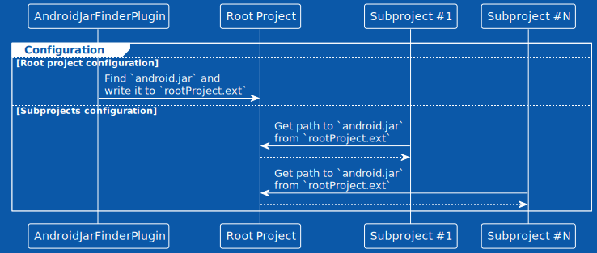
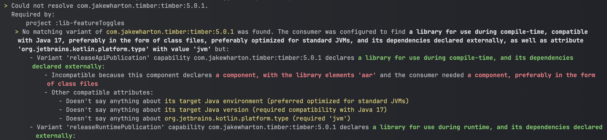

+++
title = "Gradle заставляет избавляться от Android-модулей"
date = "2024-08-11"

[taxonomies]
tags = ["gradle", "gitlab", "android"]

+++

Ты уже оптимизировал билд кэши на CI, но время прогонов в МРах неуклонно переваливает за 10 минут? Не хочешь лезть в импакт анализ? Долгий синк проекта в студии?

<center>


</center>

~~Да и хуй с ним!~~

Еще остались способы уменьшить потребление памяти во время синка/сборки и ускорить билд.

# Проблема

Android Gradle Plugin это тяжелая штука. Модуль с подключенным AGP (например с `com.android.library`) конфигурируется в два раза дольше чем обычный jvm модуль java/kotlin. В момент конфигурации android-модуля потребляется в два раза больше оперативной памяти. У модуля с AGP больше тасок, больше вес output артефактов, больше триггеров для инвалидации билд-кэша.

В крупных проектах, когда у нас есть возможность использовать модули без AGP, мы должны это делать ради времени билда и конфигурации.

К сожалению в 90% случаев мы не можем оставить модуль обычным JVM модулем из-за того что он ссылается на какие-то сущности из Android SDK или библиотеки, распространяемые в виде AAR артефактов.

# Решение

> Решение придумано не мной. Спасибо за первоисточник Степану Гончарову и его плагинам [android-jar](https://github.com/stepango/android-jar) и [aar2jar](https://github.com/stepango/aar2jar).

TLDR; Решение в том чтобы разрешить JVM модулям зависеть от Android SDK и AAR, при этом не подключая AGP.

## Избавляемся от AGP в модулях

Путь отказа от AGP состоит из двух шагов, которые впервые в публичном поле [озвучил Степан Гончаров в своем докладе](https://www.youtube.com/watch?v=Yft6h7JkWo0). У него даже остался исходный код на GitHub, который к сожалению уже не работает на новых версиях Gradle.

### Избавляемся чуть-чуть (android-jar)

> Первоисточник: [https://github.com/stepango/android-jar](https://github.com/stepango/android-jar)

Первым делом мы можем избавиться от AGP в тех модулях, которые каким-либо образом зависят от классов чистого Android, от содержимого пакетов `android.*`. 

Например, часто встречается зависимость от класса `android.content.Context`.

AGP под капотом подключает к модулю `android.jar` - API от той версии Android под которую ты разрабатываешь (target sdk). Этот JAR не вшивается в твое приложение, он используется только на этапе сборки. Чтобы провалидировать все вызовы API Android из твоего кода, и чтобы в IDE автокомплит работал. По-умному говорят что `android.jar` входит в compile classpath, но не входит в runtime classpath. Подробнее об этом можно почитать [тут](https://techblog.bozho.net/runtime-classpath-vs-compile-time-classpath/). Когда приложение попадает на устройство или эмулятор, в рантайме оно уже [пользуется реальным android.jar](https://stackoverflow.com/questions/50283073/what-is-android-jar-what-does-it-include).

> compileClasspath можно воспринимать как аналог заголовочных (.h) файлов в Си/С++. Им не обязательно нести реализацию. Они нужны в первую очередь для того, чтобы дать нам API внешних библиотек.

Фишка в том что никто не мешает нам подключить к JVM модулю `android.jar` самостоятельно, при этом избежав подключения всего AGP. В Gradle для этого есть конфигурация `compileOnly`:

```groovy
// build.gradle

dependencies {
    compileOnly(androidJar)
}
```

Но откуда в контексте билдскрипта возьмется `androidJar`? Мы его туда сами добавим. Причем сделаем это так чтобы работало и в скриптах Groovy, и в KTS (осуждаю).

#### Определяем расположение `android.jar`

Поиск нужного нам файла будет происходить на этапе конфигурации корневого проекта. Искать можно с помощью вот такого класса:

```kotlin
private class AndroidJarFinder(private val project: Project) {

    fun find(compileSdk: Int): ConfigurableFileCollection =
        project.files("${findSdkLocation()}/platforms/android-${compileSdk}/android.jar")

    private fun findSdkLocation(): File {
        val localProperties = File(project.rootDir, "local.properties").takeIf { it.exists() }
        return localProperties?.let(::getSdkDirFromLocalProperties)
            ?: getSdkDirFromEnvVariable()
            ?: throw RuntimeException(
                "The Android SDK location could not be found in following locations:" +
                        "- Absolute path `sdk.dir` in `local.properties` file\n" +
                        "- Relative path `android.dir` in `local.properties` file\n" +
                        "- `ANDROID_HOME` environment variable\n" +
                        "- System property `android.home`"
            )
    }

    private fun getSdkDirFromLocalProperties(localProperties: File): File? {
        val properties = Properties()
        FileInputStream(localProperties).use(properties::load)
        // `sdk.dir` is for absolute path, `android.dir` is for relative
        return properties.getProperty("sdk.dir")?.let(::File)
            ?: properties.getProperty("android.dir")?.let { File(project.rootDir, it) }
    }

    private fun getSdkDirFromEnvVariable(): File? {
        return System.getenv("ANDROID_HOME")?.let(::File)
            ?: System.getProperty("android.home")?.let(::File)
    }
}
```

Ищем путь до установленного в систему android sdk в 4 местах:
- Свойство `sdk.dir` в `local.properties`.
- Свойство `android.dir` в `local.properties` — обычно тут указывается путь до Android SDK установленный в директорию проекта.
- Переменная окружения `ANDROID_HOME`.
- Java System property `android.home`.

К корневому проекту должен быть подключен какой-нибудь Convention-плагин, который вызовет у себя `rememberAndroidJar`:

```kotlin
private const val AndroidJarLocationKey = "EXAMPLE_INTERNAL__ANDROID_JAR_LOCATION"

class AndroidJarFinderConventionPlugin : Plugin<Project> {

    override fun apply(target: Project) {
        assert(target == target.rootProject) {
            "Plugin 'jar.finder' can be applied only to root project"
        }
        target.rememberAndroidJar()
    }

    /** В `ext` корневого проекта кладем найденный `android.jar` */
    internal fun Project.rememberAndroidJar() {
        val targetSdk = 35 // сами придумайте откуда его брать
        val androidJarFinder = AndroidJarFinder(this)
        val androidJar = androidJarFinder.find(targetSdk)
        extensions.extraProperties[AndroidJarLocationKey] = androidJar
    }
}

```

Конфигурация корневого проекта всегда происходит до конфигурации дочерних проектов (сабмодулей). Даже если включена фича [Configure On Demand](https://docs.gradle.org/current/userguide/multi_project_configuration_and_execution.html). Поэтому на этапе конфигурации дочерних модулей мы можем пользоваться результатами вычислений в root project:



#### Доступ к `androidJar` из дочерних модулей

Gradle позволяет добавлять в контекст скриптов расширения(extensions). Расширения могут быть любым объектом, поэтому мы создадим расширение с именем `androidJar` и запихаем внутрь него `ConfigurableFileCollection`, который уже вычислен на этапе конфигурации корневого модуля. Тогда и на Groovy, и на KTS мы сможем указывать его в качестве зависимости.

```kotlin
internal fun Project.createAndroidJarAccessorExtension() {
    extensions.add(
        /* name = */ "androidJar",
        /* extension = */ checkNotNull(rootProject.extensions.extraProperties[AndroidJarLocationKey]) {
            "The property with 'android.jar' location is missing. Make sure the " +
                    "'jar.finder' plugin is applied in the root project"
        }
    )
}
```

В convention-плагине Kotlin JVM модуля применяем:

```kotlin
class KotlinJvmConventionPlugin : Plugin<Project> {

    override fun apply(target: Project) {
        ...
        target.createAndroidJarAccessorExtension()
    }
}
```

Теперь прописывая в Kotlin JVM модулях зависимость `compileOnly(androidJar)` мы сможем использовать в них Context и другие андроидовские классы.

### Избавляемся полностью жестб (aar-to-jar)

> Первоисточник: [https://github.com/stepango/aar2jar](https://github.com/stepango/aar2jar)

По опыту могу сказать, что для большинства модулей в проекте подключения android jar не будет достаточно. Мы часто используем внешние библиотеки, которые можно подключить только к android-модулям. 

Все дело в том что библиотеки под Android распространяются в виде AAR артефактов. JVM модули не знают о таких и позволяют подключать к себе только JAR библиотеки. Если мы [заглянем внутрь AAR](https://developer.android.com/studio/projects/android-library#aar-contents), то увидим что это ZIP архив внутри которого содержатся всякие андроидо-специфичные штуки и... JAR файлы с кодом.

#### Решение на русском языке

Чтобы наши pure kotlin/java модули научились понимать AAR зависимости, нам нужно всего лишь ~~старый советский~~ распаковать AAR, вытащить из него JAR файлы и подключить их в качестве зависимостей к нашему модулю. Звучит не сложно да?

#### Реализация

В Gradle есть встроенный механизм, позволяющий без большого количества костылей описать процесс трансформации зависимостей из одного формата в другой — Artifact Transform. У нее [есть непонятная дока](https://docs.gradle.org/current/userguide/artifact_transforms.html) (как и любая дока по Gradle), но в нашем случае суть довольно проста:

> `TransformAction` можно рассматривать как Task Action, но у которого есть ровно один input и один output. И этот Action предназначен только для конвертации одного артефакта в другой.
>
> Когда какой-либо input у таски имеет "непонятный тип", Gradle попытается привести его к "понятному типу" путем применения нужных трансформаций.
>
> Нам нужен такой `TransformAction`, который получив на вход AAR либу, выплюнет наружу ее JAR файлы

Собсна `TransformAction` может выглядеть вот так:

```kotlin
abstract class Aar2JarTransformAction : TransformAction<TransformParameters.None> {

    @get:InputArtifact
    @get:PathSensitive(PathSensitivity.RELATIVE)
    abstract val inputArtifact: Provider<FileSystemLocation>

    override fun transform(outputs: TransformOutputs) {
        val inputFile = inputArtifact.get().asFile
        val baseName = inputFile.nameWithoutExtension
        ZipFile(inputFile).use { zipFile ->
            zipFile
                .entries()
                .toList()
                .filter { entry -> entry.name.endsWith(".jar") }
                .forEach { entry ->
                    val outputName = when (entry.name) {
                        "classes.jar" -> "$baseName.jar"
                        else -> "$baseName-${entry.name}"
                    }
                    outputs.file(outputName).outputStream().use { output ->
                        zipFile.getInputStream(entry).use { entryStream ->
                            entryStream.copyTo(output)
                        }
                    }
                }
        }
    }
}
```

Эта версия немного отличается от оригинальной. Она умеет работать с AAR, в которые упаковано более одного `classes.jar`.

Ну и дальше в нашем Convention-плагине для Kotlin/Java JVM модулей мы должны зарегистрировать кастомный `TransformAction`, вызвав `configureAar2JarFeature`:

```kotlin
fun Project.configureAar2JarFeature() {
    val artifactTypeAttribute = ArtifactTypeDefinition.ARTIFACT_TYPE_ATTRIBUTE

    // Регистрируем нашу трансформилку
    dependencies.registerTransform(Aar2JarTransformAction::class.java) { spec ->
        spec.from.attribute(artifactTypeAttribute, "aar")
        spec.to.attribute(artifactTypeAttribute, "jar")
    }
}
```

> При регистрации указываем, что наша поделка трансформирует артефакты из AAR в JAR. Подробнее про атрибуты есть [непонятная дока от Gradle](https://docs.gradle.org/current/userguide/variant_attributes.html).

#### Пробуем подключить AAR либу через `compileOnly`

Чтобы протестировать, что наше решение НЕ РАБОТАЕТ, попробуем подключить к Kotlin модулю библиотеку Timber ~~(у нее AAR, брат)~~. Подключим ее через конфигурацию `compileOnly`:

```groovy
dependencies {
    compileOnly(libs.timber)
}
```

Во время синка будет ошибка вот такого рода:



Я до конца так и не понял, как это обойти. Возможно в одном issue и кроется ответ: [github.com/gradle/gradle/issues/8386](https://github.com/gradle/gradle/issues/8386). 
Если выражаться на птичьем языке — какие-то из атрибутов конфигурации `compileOnly` несовместимы с подключаемыми AAR. А обойти это можно создав отдельную конфигурацию и вкинув ее содержимое в java compile classpath ручками. Пиздеееец.

#### Пробуем подключить AAR либу через `aarCompileOnly`

Создаем конфигурацию с именем `aarCompileOnly`. будем с ее помощью подключать андроидовские библиотеки к Kotlin модулям. Дополняем функцию `configureAar2JarFeature`:

```kotlin
fun Project.configureAar2JarFeature() {
    val artifactTypeAttribute = ArtifactTypeDefinition.ARTIFACT_TYPE_ATTRIBUTE

    configurations.register("aarCompileOnly") { aarCompileOnly ->
        with(aarCompileOnly) {
            isTransitive = false // не подсасываем транзитивные зависимости
            isCanBeConsumed = false
            attributes.attribute(artifactTypeAttribute, "jar")
        }
        plugins.withId("java") {
            javaExtension.sourceSets.named("main") { main ->
                main.compileClasspath += aarCompileOnly
            }
        }
    }

    // Регистрируем нашу трансформилку
    ...
}

private val Project.javaExtension: JavaPluginExtension
    get() = extensions.getByType(JavaPluginExtension::class.java)
```

Пробуем подключить Timber еще раз:

```groovy
dependencies {
    aarCompileOnly(libs.timber)
}
```

И омагад, оно работает. Можно импортировать Timber в нашем Kotlin модуле, а потом это еще и без ошибок скомпилируется.

#### Докручиваем решение

Для того чтобы можно было подключать какие-то Android-библиотеки к Unit-тестам, нужна еще одна конфигурация: `aarTestImplementation`. Получается такой странный набор кастомных конфигураций, я объясню это в конце.

```kotlin
fun Project.configureAar2JarFeature() {
    val artifactTypeAttribute = ArtifactTypeDefinition.ARTIFACT_TYPE_ATTRIBUTE

    configurations.register("aarCompileOnly") { ... }

    configurations.register("aarTestImplementation") { aarTestImplementation ->
        with(aarTestImplementation) {
            isTransitive = false
            isCanBeConsumed = false
            attributes.attribute(artifactTypeAttribute, "jar")
        }
        plugins.withId("java") {
            javaExtension.sourceSets.named("test") { test ->
                test.compileClasspath += aarTestImplementation
                test.runtimeClasspath += aarTestImplementation
            }
        }
    }
}
```

И вишенкой на торте можно добавить фикс, нужный для корректной работы GUI Android Studio и IntelliJ IDEA с новыми конфигурациями:

```kotlin
internal fun Project.configureAar2JarFeature() {
    ...

    configurations.register("aarCompileOnly") { aarCompileOnly ->
        ...
        // Register configuration in IDEA if needed
        plugins.withId("idea") {
            ideaExtension.module.scopes.forEach { (_, value) ->
                value["plus"]?.add(aarCompileOnly)
            }
        }
    }

    configurations.register("aarTestImplementation") { aarTestImplementation ->
        ...
        // Register configuration in IDEA if needed
        plugins.withId("idea") {
            ideaExtension.module.scopes["TEST"]
                ?.get("plus")?.add(aarTestImplementation)
        }
    }
}

private val Project.ideaExtension: IdeaModel
    get() = extensions.getByType(IdeaModel::class.java)
```

На этом все, пользуйтесь на здоровье. А теперь читаем про побочные эффекты этой черной магии.

# О чем стоит помнить

## Может упасть в рантайме

Библиотеки, добавленные через `aarCompileOnly` конфигурацию должны быть добавлены где-то еще в проекте через `runtimeOnly` или `implementation`. Например, в модуле `:app`.

<center>


</center>

Все потому что, как я уже писал, если библиотека есть в compile classpath, но отсутствует в runtime classpath, она не поедет вместе с вашим приложением на прод. И при обращении к любому ее классу в рантайме будет `NoClassDefFoundError`.

> Так чисто на всякий случай пишу что `implementation(androidJar)` писать нигде не надо, потому что в рантайме он всегда есть и без вашей помощи.

## Странный набор конфигураций

AAR библиотеки как правило несут в себе иного другой полезной инфы, нужной для сборки Android приложения. Например, AndroidManifest и proguard файлы. Когда мы подключаем такую библиотеку через aar-to-jar трансформацию, мы все это успешно выбрасываем.

Поэтому я считаю что подключать AAR к jvm модулям нужно только через `aarCompileOnly`. Подключать только ради доступа к API. При этом в `:app` модуле подключать эти библиотеки через `implementation`.

Конфигурация `aarTestImplementation` подключает либу и в compile, и в runtime classpath. Это нужно для того чтобы Unit-тесты можно было запустить и чтоб они не падали из-за `NoClassDefFoundError`.

## Погибает android lint

Мы теряем возможность использования Android Lint, отключая AGP от модуля. Хорошо что у нас есть Detekt.

# Итоги

Избавление от AGP это один из самых эффективных способов снизить время конфигурации в большом проекте. И один из последних способов снизить билд-тайм, не внедряя impact-анализ.

Решение из этой заметки не новое, но я постарался хотя бы по верхам объяснить, за счет чего оно работает.
